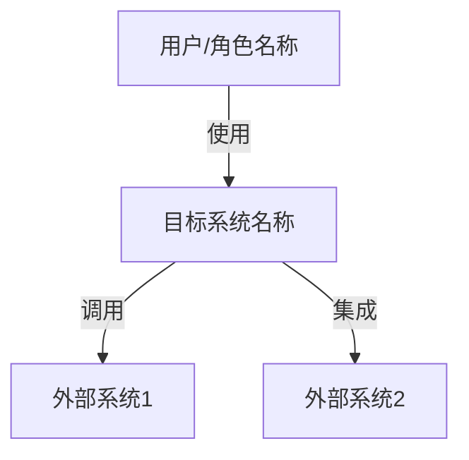
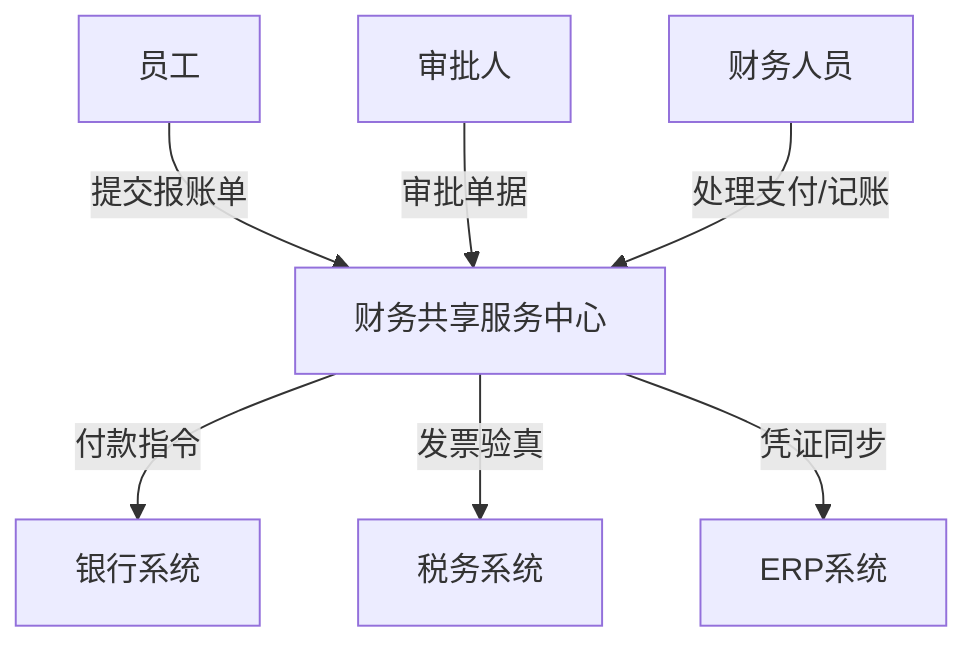
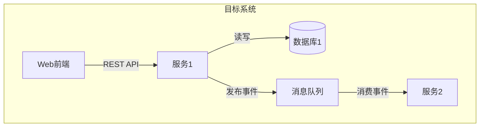
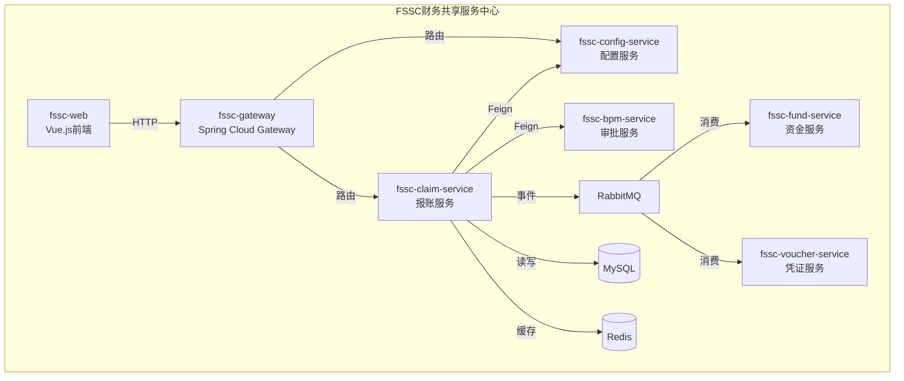
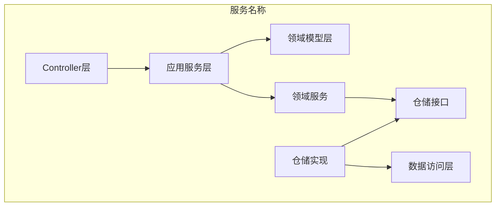
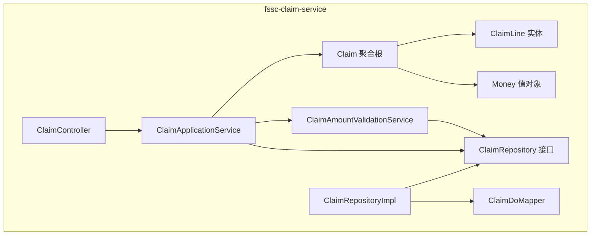
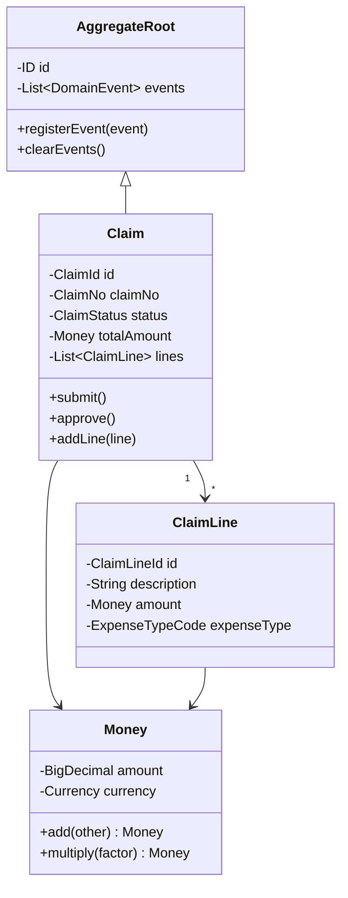

# C4 模型模板

> C4 模型提供四个层次的架构视图：系统上下文、容器、组件、代码。
> 使用 Mermaid 语法，可直接在 Markdown 中渲染。

---

## Level 1: 系统上下文图（System Context）

**目的**: 展示系统与外部用户、外部系统的关系



**填写模板**:

```yaml
system_context:
  system:
    name: "{系统名称}"
    description: "{系统一句话描述}"
  
  users:
    - name: "{用户角色1}"
      description: "{角色描述}"
      interaction: "{如何使用系统}"
    - name: "{用户角色2}"
      description: "{角色描述}"
      interaction: "{如何使用系统}"
  
  external_systems:
    - name: "{外部系统1}"
      description: "{系统描述}"
      interaction: "{集成方式和目的}"
    - name: "{外部系统2}"
      description: "{系统描述}"
      interaction: "{集成方式和目的}"
```

### 示例：财务共享服务中心



---

## Level 2: 容器图（Container）

**目的**: 展示系统内部的技术构成（服务、数据库、消息队列等）



**填写模板**:

```yaml
containers:
  - name: "{容器名称}"
    type: "Web App / Service / Database / MQ / Cache"
    technology: "{技术栈}"
    description: "{容器职责}"
    
  relationships:
    - from: "{容器A}"
      to: "{容器B}"
      description: "{交互说明}"
      technology: "{通信技术}"
```

### 示例：FSSC 容器图



---

## Level 3: 组件图（Component）

**目的**: 展示单个容器内部的组件结构（对应 DDD 分层）



**填写模板**:

```yaml
components:
  container: "{所属容器名称}"
  layers:
    interface:
      - name: "{Controller名}"
        responsibility: "{职责}"
    application:
      - name: "{Application Service名}"
        responsibility: "{职责}"
    domain:
      entities:
        - name: "{Entity名}"
          type: "aggregate_root / entity / value_object"
      services:
        - name: "{Domain Service名}"
          responsibility: "{职责}"
      repositories:
        - name: "{Repository名}"
    infrastructure:
      - name: "{实现类名}"
        responsibility: "{职责}"
```

### 示例：报账服务组件图



---

## Level 4: 代码图（Code）

**目的**: 展示类级别的详细设计（通常由 IDE 自动生成，此处提供类图模板）



---

## 使用说明

1. **自顶向下**: 从 Level 1 开始，逐层细化
2. **按需深入**: 不需要每个组件都画到 Level 4
3. **保持更新**: 架构变更时同步更新图表
4. **受众适配**: Level 1-2 给管理层看，Level 3-4 给开发团队看
