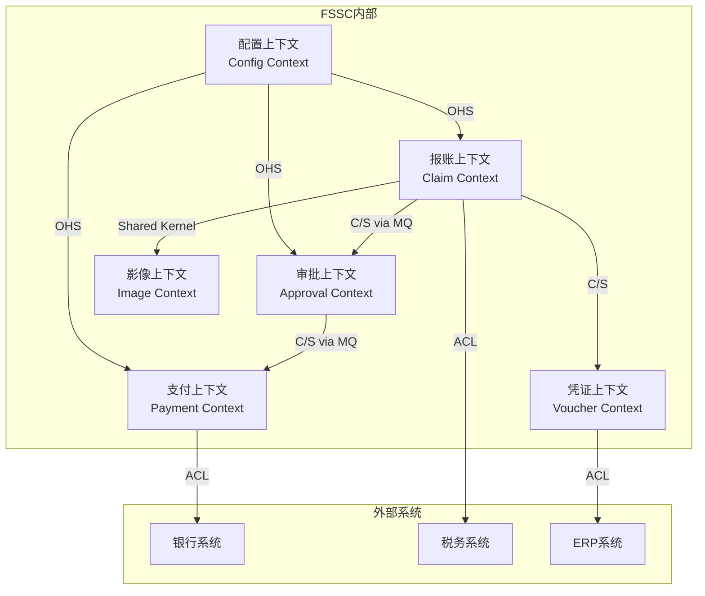

# 上下文映射模板（Context Map Template）

## 1. 上下文清单

### 填写表格

| 编号 | 上下文名称 | 英文名 | 核心职责 | 负责团队 | 核心聚合 |
|------|-----------|--------|----------|----------|---------|
| BC-1 | {上下文1} | {EnglishName1} | {职责描述} | {团队} | {聚合列表} |
| BC-2 | {上下文2} | {EnglishName2} | {职责描述} | {团队} | {聚合列表} |
| BC-3 | {上下文3} | {EnglishName3} | {职责描述} | {团队} | {聚合列表} |

---

## 2. 上下文关系矩阵

> U=上游 D=下游 SK=共享内核 SW=各行其道 -=无关系

|  | BC-1 | BC-2 | BC-3 | BC-4 | BC-5 |
|------|------|------|------|------|------|
| **BC-1** | - | U | U | SK | SW |
| **BC-2** | D | - | - | - | - |
| **BC-3** | D | - | - | U | - |
| **BC-4** | SK | - | D | - | - |
| **BC-5** | SW | - | - | - | - |

---

## 3. 关系详情

### 模板

```yaml
relationship:
  id: "REL-{序号}"
  upstream: "{上游上下文}"
  downstream: "{下游上下文}"
  pattern: "{关系模式}"  # Partnership/SharedKernel/CustomerSupplier/Conformist/ACL/OHS/PL/SeparateWays
  communication: "{通信方式}"  # REST/gRPC/MQ/SharedDB
  data_flow: "{数据流向描述}"
  shared_models: "{共享的模型或事件}"
  acl_needed: true/false
  notes: "{补充说明}"
```

### 示例

```yaml
relationships:
  - id: "REL-01"
    upstream: "报账上下文"
    downstream: "审批上下文"
    pattern: "Customer-Supplier"
    communication: "MQ (ClaimSubmittedEvent)"
    data_flow: "报账单提交后通知审批上下文创建审批流程"
    shared_models: "ClaimSubmittedIntegrationEvent"
    acl_needed: false
    notes: "审批上下文可对报账上下文提出API需求"

  - id: "REL-02"
    upstream: "审批上下文"
    downstream: "支付上下文"
    pattern: "Customer-Supplier"
    communication: "MQ (ApprovalCompletedEvent)"
    data_flow: "审批通过后通知支付上下文创建付款单"
    shared_models: "ApprovalCompletedIntegrationEvent"
    acl_needed: false

  - id: "REL-03"
    upstream: "银行网关（外部）"
    downstream: "支付上下文"
    pattern: "ACL"
    communication: "REST + ACL翻译层"
    data_flow: "支付上下文调用银行接口执行付款"
    acl_needed: true
    notes: "需设计BankGateway防腐层隔离各银行API差异"

  - id: "REL-04"
    upstream: "配置上下文"
    downstream: "报账上下文 / 审批上下文 / 支付上下文"
    pattern: "Open Host Service"
    communication: "REST (Feign Client)"
    data_flow: "提供组织架构、费用类型、审批配置等基础数据"
    shared_models: "DepartmentDto, ExpenseTypeDto"
    acl_needed: false
```

---

## 4. Mermaid 映射图

### 生成模板

```mermaid
graph TB
    subgraph 内部上下文
        BC1[{上下文1}]
        BC2[{上下文2}]
        BC3[{上下文3}]
    end

    subgraph 外部系统
        EXT1[{外部系统1}]
        EXT2[{外部系统2}]
    end

    BC1 -->|{关系模式}| BC2
    BC2 -->|{关系模式}| BC3
    BC3 -->|ACL| EXT1
    BC1 -->|{关系模式}| EXT2
```

### 示例：FSSC 上下文映射图



---

## 5. 集成合约记录

### 模板

| 合约ID | 上游 | 下游 | 接口/事件 | 数据格式 | 版本 | 状态 |
|--------|------|------|----------|---------|------|------|
| {ID} | {上游} | {下游} | {接口名或事件名} | {JSON/Protobuf} | v{X} | {活跃/废弃} |

### 示例

| 合约ID | 上游 | 下游 | 接口/事件 | 版本 | 状态 |
|--------|------|------|----------|------|------|
| CTR-01 | 配置 | 报账 | GET /api/v1/config/expense-types/{code} | v1 | 活跃 |
| CTR-02 | 报账 | 审批 | ClaimSubmittedIntegrationEvent (MQ) | v1 | 活跃 |
| CTR-03 | 审批 | 支付 | ApprovalCompletedIntegrationEvent (MQ) | v1 | 活跃 |
| CTR-04 | 支付 | 银行 | POST /icbc/payment/execute (ACL封装) | v2 | 活跃 |

---

## 6. 检查清单

- [ ] 所有限界上下文已列出
- [ ] 上下文间关系已识别（使用关系矩阵）
- [ ] 每个关系有明确的集成模式
- [ ] 外部系统已识别并设计ACL
- [ ] 通信方式（同步/异步）已确定
- [ ] 共享模型/事件已定义
- [ ] 集成合约已记录
- [ ] Mermaid映射图已生成
