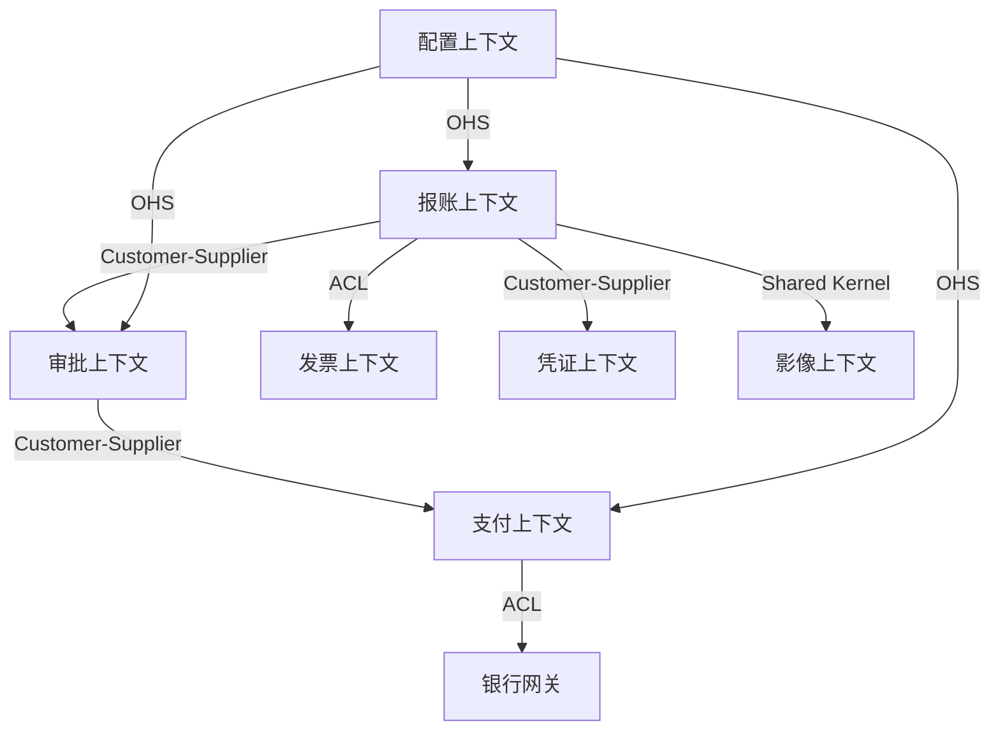

# 限界上下文（Bounded Context）

## 1. 核心概念

限界上下文是模型的适用范围边界。在边界内，通用语言中的每个术语有唯一明确含义；跨越边界，同一术语可能含义不同。

### 识别标准

| 信号 | 说明 |
|------|------|
| **语言分歧** | 同一术语在不同团队中含义不同 |
| **模型冲突** | 同一实体在不同场景需要不同的属性和行为 |
| **团队边界** | 不同团队负责不同的业务域 |
| **变更频率** | 某些部分变化频繁，另一些相对稳定 |
| **部署独立性** | 某些部分需要独立部署和扩展 |

---

## 2. 上下文识别方法

### 2.1 启发式问题

```
1. 这个术语在哪些场景下含义不同？
   → 不同含义 = 不同上下文

2. 哪些业务规则必须放在一起保证一致性？
   → 强一致要求 = 同一上下文

3. 哪些部分由不同团队维护？
   → 不同团队 = 倾向不同上下文

4. 哪些模型变化独立？
   → 独立变化 = 不同上下文

5. 如果拆开，需要频繁同步吗？
   → 频繁同步 = 可能不应拆开
```

### 2.2 实例：财务共享中心

```
┌─────────────────────────────────────────────────────┐
│                 财务共享服务中心                        │
│                                                     │
│  ┌──────────┐  ┌──────────┐  ┌──────────┐          │
│  │  报账上下文 │  │  审批上下文 │  │  支付上下文 │          │
│  │          │  │          │  │          │          │
│  │ • 报账单  │  │ • 审批流程 │  │ • 付款单  │          │
│  │ • 报账行  │  │ • 审批节点 │  │ • 银行账户 │          │
│  │ • 费用类型│  │ • 审批规则 │  │ • 支付记录 │          │
│  │ • 发票   │  │ • 审批人  │  │ • 对账   │          │
│  └──────────┘  └──────────┘  └──────────┘          │
│                                                     │
│  ┌──────────┐  ┌──────────┐  ┌──────────┐          │
│  │  配置上下文 │  │  凭证上下文 │  │  影像上下文 │          │
│  │          │  │          │  │          │          │
│  │ • 组织架构│  │ • 会计凭证 │  │ • 影像采集 │          │
│  │ • 费用标准│  │ • 科目映射 │  │ • OCR识别 │          │
│  │ • 审批配置│  │ • 过账规则 │  │ • 影像存储 │          │
│  └──────────┘  └──────────┘  └──────────┘          │
└─────────────────────────────────────────────────────┘
```

---

## 3. 上下文映射关系

### 3.1 关系类型

| 关系模式 | 说明 | 适用场景 |
|----------|------|----------|
| **合作关系 (Partnership)** | 两个上下文紧密协作，共同演进 | 同一团队维护的强相关上下文 |
| **共享内核 (Shared Kernel)** | 共享一小部分模型代码 | 稳定的通用概念（如用户、组织） |
| **客户-供应商 (Customer-Supplier)** | 上游提供服务，下游消费 | 明确的依赖关系 |
| **遵奉者 (Conformist)** | 下游完全采用上游模型 | 无法影响上游（如第三方API） |
| **防腐层 (ACL)** | 翻译层隔离外部模型 | 防止外部模型污染自身 |
| **开放主机服务 (OHS)** | 提供标准化协议供外部访问 | 多个消费者的公共服务 |
| **发布语言 (PL)** | 使用标准格式交换数据 | 跨系统集成 |
| **各行其道 (Separate Ways)** | 完全独立，无直接集成 | 关联微弱的上下文 |

### 3.2 关系选择决策树

```
两个上下文需要交互吗？
├── 否 → 各行其道（Separate Ways）
└── 是 → 你能影响上游吗？
          ├── 否 → 上游模型可接受吗？
          │        ├── 是 → 遵奉者（Conformist）
          │        └── 否 → 防腐层（ACL）
          └── 是 → 紧密合作还是上下游关系？
                   ├── 紧密合作 → 合作关系 / 共享内核
                   └── 上下游 → 客户-供应商（C/S）
                                提供方 → 开放主机服务（OHS）
```

### 3.3 映射图示例（Mermaid）



---

## 4. 上下文边界设计

### 4.1 边界划分原则

1. **语言边界**：当同一术语含义不同时，必须划分边界
2. **一致性边界**：强一致性要求的概念放在同一上下文
3. **团队边界**：一个上下文由一个团队负责
4. **自治性**：每个上下文可以独立开发、测试、部署

### 4.2 边界通信

```
上下文间通信方式:
━━━━━━━━━━━━━━━━━━━━━━━━━━━━━━
同步调用:
  • REST API / gRPC
  • Feign Client（Spring Cloud）
  • 适用：查询、需要即时响应的操作

异步消息:
  • 领域事件 + 消息队列
  • 适用：命令、状态变更通知
  • 实现最终一致性

共享数据库（不推荐）:
  • 仅在共享内核模式下有限使用
  • 违反上下文自治原则
```

---

## 5. 应用示例

### 示例1: 报账单在不同上下文中的建模

```java
// ========== 报账上下文 ==========
// "报账单"是聚合根，关注创建、编辑、行项管理
public class Claim {
    private ClaimId id;
    private ClaimNo claimNo;
    private ClaimStatus status;
    private UserId applicantId;
    private Money totalAmount;
    private List<ClaimLine> lines;
    
    public void addLine(ClaimLine line) { ... }
    public void submit() { ... }
}

// ========== 审批上下文 ==========
// "审批请求"引用报账单ID，关注审批流程
public class ApprovalRequest {
    private ApprovalId id;
    private String sourceId; // 报账单ID（ID引用，非对象引用）
    private String sourceType; // "CLAIM"
    private ApprovalStatus status;
    private List<ApprovalNode> nodes;
    
    public void approve(ApproverId approverId) { ... }
    public void reject(ApproverId approverId, String reason) { ... }
}

// ========== 支付上下文 ==========
// "付款单"关注支付执行
public class PaymentOrder {
    private PaymentId id;
    private String claimId; // 报账单ID（ID引用）
    private Money amount;
    private BankAccount payeeAccount;
    private PaymentStatus status;
    
    public void execute() { ... }
    public void confirm(String bankTransactionId) { ... }
}
```

### 示例2: 防腐层设计

```java
/**
 * 发票上下文的防腐层
 * 将外部税务系统的发票模型转换为内部领域模型
 */
public class InvoiceAntiCorruptionLayer {

    private final TaxSystemClient taxSystemClient;

    /**
     * 将外部发票数据转换为内部发票领域对象
     */
    public Invoice translateFromExternal(String invoiceCode) {
        // 调用外部系统
        TaxInvoiceResponse external = taxSystemClient.query(invoiceCode);
        
        // 转换为内部模型（翻译层）
        return Invoice.builder()
            .invoiceNo(new InvoiceNo(external.getFpdm(), external.getFphm()))
            .amount(new Money(external.getJe(), Currency.CNY))
            .taxAmount(new Money(external.getSe(), Currency.CNY))
            .issueDate(parseDate(external.getKprq()))
            .sellerName(external.getXfmc())
            .verified(external.getYzzt() == 1)
            .build();
    }
}
```

### 示例3: 微服务边界划分

```yaml
# 基于限界上下文的微服务划分

services:
  fssc-claim-service:
    bounded_context: 报账上下文
    responsibilities:
      - 报账单创建与编辑
      - 行项管理
      - 发票关联
    owns_data:
      - t_claim
      - t_claim_line
    depends_on:
      - fssc-config-service  # 获取配置（OHS）
      - fssc-bpm-service     # 提交审批（C/S）
      - fssc-image-service   # 影像关联（Shared Kernel）

  fssc-bpm-service:
    bounded_context: 审批上下文
    responsibilities:
      - 审批流程管理
      - 审批规则执行
    owns_data:
      - t_approval_request
      - t_approval_node
    publishes_events:
      - ApprovalCompletedEvent
      - ApprovalRejectedEvent

  fssc-fund-service:
    bounded_context: 支付上下文
    responsibilities:
      - 付款单管理
      - 银行接口调用
      - 对账处理
    owns_data:
      - t_payment_order
      - t_bank_transaction
    consumes_events:
      - ApprovalCompletedEvent → 触发付款
```

---

## 检查清单

### 上下文识别
- [ ] 已识别所有限界上下文
- [ ] 每个上下文有明确的职责边界
- [ ] 上下文间无术语歧义
- [ ] 每个上下文由明确的团队负责

### 上下文映射
- [ ] 所有上下文间关系已识别
- [ ] 每个关系有明确的集成模式
- [ ] 需要隔离的外部系统已设计 ACL
- [ ] 通信方式（同步/异步）已确定

### 边界设计
- [ ] 上下文间通过 API/事件通信
- [ ] 不存在跨上下文的直接数据库访问
- [ ] 聚合间使用 ID 引用而非对象引用
