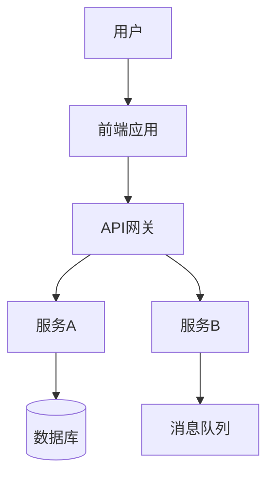

# 架构愿景文档

> 对应 TOGAF 10 ADM 阶段 A 的核心交付物。
> 架构愿景定义了架构工作的范围、利益相关者需求和目标架构的高层描述。

---

## 文档信息

| 项目 | 内容 |
|------|------|
| 项目名称 | [项目名称] |
| 文档版本 | v1.0 |
| 编制日期 | [YYYY-MM-DD] |
| 编制人 | [编制人] |
| 审批状态 | [草案/评审中/已批准] |
| 审批人 | [审批人] |

---

## 1. 项目背景与业务驱动

### 1.1 项目背景

[描述项目的起因和背景]

### 1.2 业务驱动力

| 驱动力 | 描述 | 优先级 |
|--------|------|--------|
| [驱动力1] | [具体描述] | 高/中/低 |
| [驱动力2] | [具体描述] | 高/中/低 |

### 1.3 业务目标

| 目标 | 度量指标 | 目标值 | 时间 |
|------|---------|--------|------|
| [目标1] | [KPI] | [目标值] | [时间] |
| [目标2] | [KPI] | [目标值] | [时间] |

---

## 2. 利益相关者分析

### 2.1 利益相关者矩阵

| 利益相关者 | 角色 | 关注点 | 影响力 | 参与级别 | 沟通频率 |
|-----------|------|--------|--------|---------|---------|
| [高管层] | 赞助者 | 投资回报、战略对齐 | 高 | 决策 | 月度 |
| [业务部门] | 使用者 | 功能满足、易用性 | 中 | 验证 | 双周 |
| [IT团队] | 实施者 | 技术可行性、工作量 | 中 | 深度参与 | 每日 |
| [运维团队] | 运营者 | 可运维性、稳定性 | 低 | 咨询 | 月度 |

### 2.2 关注点映射

```
高管层 → 投资回报、战略价值、风险控制
业务部门 → 业务流程改善、用户体验、培训成本
IT团队 → 技术可行性、架构合理性、开发效率
运维团队 → 系统稳定性、可监控性、故障恢复
```

---

## 3. 架构范围

### 3.1 范围界定

| 维度 | 包含 | 排除 |
|------|------|------|
| 业务范围 | [涉及的业务域] | [不涉及的业务域] |
| 系统范围 | [涉及的系统/服务] | [不涉及的系统] |
| 组织范围 | [涉及的部门/团队] | [不涉及的部门] |
| 时间范围 | [开始-结束] | — |
| 地域范围 | [涉及的区域] | [不涉及的区域] |

### 3.2 关键约束

| 约束类型 | 描述 |
|----------|------|
| 时间约束 | [截止日期/里程碑] |
| 预算约束 | [预算范围] |
| 技术约束 | [技术栈限制、现有系统约束] |
| 组织约束 | [人员限制、审批流程] |
| 法规约束 | [合规要求] |

---

## 4. 架构愿景描述

### 4.1 目标架构高层视图

[用 Mermaid 或文字描述目标架构的高层视图]



### 4.2 关键架构变化

| 维度 | 当前（As-Is） | 目标（To-Be） | 关键变化 |
|------|--------------|--------------|---------|
| 业务 | [...] | [...] | [...] |
| 数据 | [...] | [...] | [...] |
| 应用 | [...] | [...] | [...] |
| 技术 | [...] | [...] | [...] |

### 4.3 价值主张

| 价值维度 | 预期收益 | 实现方式 |
|----------|----------|---------|
| 业务效率 | [...] | [...] |
| 成本优化 | [...] | [...] |
| 技术能力 | [...] | [...] |
| 风险降低 | [...] | [...] |

---

## 5. 适用的架构原则

| 编号 | 原则名称 | 声明 | 对本项目的影响 |
|------|---------|------|--------------|
| AP-001 | [...] | [...] | [...] |
| AP-002 | [...] | [...] | [...] |

---

## 6. 风险初步评估

| 风险 | 概率 | 影响 | 缓解策略 |
|------|------|------|---------|
| [...] | 高/中/低 | 高/中/低 | [...] |

---

## 7. 架构工作说明书

### 7.1 工作方法

- **架构框架**: TOGAF 10（定制化）
- **ADM 范围**: [预备→A→B→C→D→E→F→G→H / 部分阶段]
- **迭代策略**: [瀑布/迭代/混合]

### 7.2 里程碑计划

| 里程碑 | 日期 | 交付物 | 负责人 |
|--------|------|--------|--------|
| 架构愿景评审 | [...] | 架构愿景文档 | [...] |
| 业务架构完成 | [...] | 业务架构定义 | [...] |
| 信息系统架构完成 | [...] | 数据/应用架构定义 | [...] |
| 技术架构完成 | [...] | 技术架构定义 | [...] |
| 迁移计划完成 | [...] | 架构路线图 | [...] |

### 7.3 资源需求

| 角色 | 人数 | 投入度 | 时间 |
|------|------|--------|------|
| 架构师 | [...] | [...] | [...] |
| 业务分析师 | [...] | [...] | [...] |
| 技术专家 | [...] | [...] | [...] |

---

## 8. 审批

| 审批人 | 角色 | 日期 | 签署 |
|--------|------|------|------|
| [...] | 项目发起人 | [...] | □ |
| [...] | 首席架构师 | [...] | □ |
| [...] | 业务负责人 | [...] | □ |
