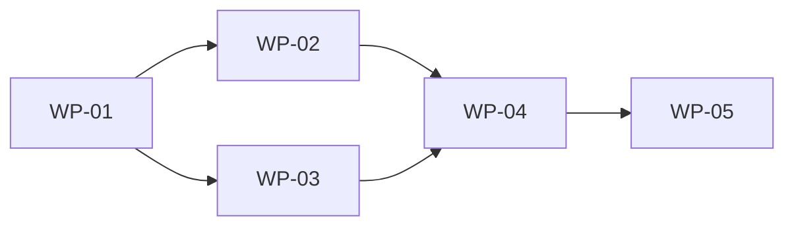

# 迁移规划模板

> 对应 TOGAF 10 ADM 阶段 E（机会与解决方案）和阶段 F（迁移规划）。
> 将差距分析结果转化为可执行的工作包和迁移计划。

---

## 文档信息

| 项目 | 内容 |
|------|------|
| 项目名称 | [项目名称] |
| 文档版本 | v1.0 |
| 编制日期 | [YYYY-MM-DD] |
| 编制人 | [编制人] |
| 审批状态 | [草案/评审中/已批准] |

---

## 1. 迁移策略

### 1.1 迁移方式

| 策略 | 描述 | 适用场景 | 本次选择 |
|------|------|---------|---------|
| 大爆炸 | 一次性切换 | 小型系统、独立系统 | □ |
| 逐步迁移 | 分批次迁移 | 大型系统、高风险系统 | □ |
| 并行运行 | 新旧系统并行 | 核心系统、不容许中断 | □ |
| 绞杀者模式 | 逐步替换旧系统功能 | 遗留系统改造 | □ |

### 1.2 迁移原则

1. [原则1，如：核心业务优先迁移]
2. [原则2，如：保证数据一致性]
3. [原则3，如：支持回滚]
4. [原则4，如：最小业务中断]

---

## 2. 过渡架构定义

### 2.1 过渡态规划

```
现状（Baseline）→ 过渡态1 → 过渡态2 → 目标态（Target）
```

### 2.2 过渡态 1

**目标**: [第一阶段要达到的状态]
**时间**: [开始-结束]
**范围**: [涉及的系统/模块]

| 变更项 | 当前 | 过渡态 1 | 说明 |
|--------|------|---------|------|
| [系统A] | [现状] | [状态] | [...] |
| [系统B] | [现状] | [状态] | [...] |

### 2.3 过渡态 2（如需要）

**目标**: [第二阶段要达到的状态]
**时间**: [开始-结束]
**范围**: [涉及的系统/模块]

| 变更项 | 过渡态 1 | 过渡态 2 | 说明 |
|--------|---------|---------|------|
| [系统A] | [状态] | [状态] | [...] |

### 2.4 目标态

**完成标志**: [所有系统达到目标架构]

---

## 3. 工作包定义

### 3.1 工作包清单

| 编号 | 工作包名称 | 描述 | 涉及域 | 优先级 | 所属过渡态 |
|------|-----------|------|--------|--------|-----------|
| WP-01 | [...] | [...] | 业务/数据/应用/技术 | P0 | 过渡态1 |
| WP-02 | [...] | [...] | [...] | P0 | 过渡态1 |
| WP-03 | [...] | [...] | [...] | P1 | 过渡态2 |

### 3.2 工作包依赖关系



### 3.3 工作包详情模板

#### WP-[编号]: [工作包名称]

| 项目 | 内容 |
|------|------|
| 描述 | [...] |
| 目标 | [...] |
| 涉及系统 | [...] |
| 关联差距 | GAP-xxx |
| 关联构建块 | ABB-xxx / SBB-xxx |
| 前置依赖 | WP-xxx |
| 预估工作量 | [人月] |
| 负责人 | [...] |
| 验收标准 | [...] |

---

## 4. 架构路线图

### 4.1 短期计划（0-6个月）

| 月份 | 工作包 | 里程碑 | 交付物 |
|------|--------|--------|--------|
| 第1-2月 | WP-01 | [里程碑] | [...] |
| 第3-4月 | WP-02 | [里程碑] | [...] |
| 第5-6月 | WP-03 | [里程碑] | [...] |

### 4.2 中期计划（6-18个月）

| 季度 | 工作包 | 里程碑 | 交付物 |
|------|--------|--------|--------|
| Q3 | WP-04, WP-05 | [里程碑] | [...] |
| Q4 | WP-06, WP-07 | [里程碑] | [...] |
| Q5 | WP-08 | [里程碑] | [...] |

### 4.3 长期计划（18-36个月）

| 半年 | 工作包 | 里程碑 | 交付物 |
|------|--------|--------|--------|
| H4 | WP-09, WP-10 | [里程碑] | [...] |
| H5 | WP-11 | [里程碑] | [...] |

---

## 5. 资源规划

### 5.1 人力资源

| 角色 | 短期 | 中期 | 长期 | 合计 |
|------|------|------|------|------|
| 架构师 | [人] | [人] | [人] | [人月] |
| 高级开发 | [人] | [人] | [人] | [人月] |
| 开发人员 | [人] | [人] | [人] | [人月] |
| 测试人员 | [人] | [人] | [人] | [人月] |
| 运维人员 | [人] | [人] | [人] | [人月] |

### 5.2 预算估算

| 类别 | 短期 | 中期 | 长期 | 合计 |
|------|------|------|------|------|
| 人力成本 | [...] | [...] | [...] | [...] |
| 硬件/云资源 | [...] | [...] | [...] | [...] |
| 软件许可 | [...] | [...] | [...] | [...] |
| 培训 | [...] | [...] | [...] | [...] |
| **合计** | [...] | [...] | [...] | [...] |

---

## 6. 风险管理

| 风险 | 概率 | 影响 | 缓解措施 | 负责人 | 触发指标 |
|------|------|------|---------|--------|---------|
| [风险1] | 高/中/低 | 高/中/低 | [...] | [...] | [...] |
| [风险2] | 高/中/低 | 高/中/低 | [...] | [...] | [...] |

---

## 7. 回滚策略

### 7.1 回滚条件

| 条件 | 判定标准 | 回滚级别 |
|------|---------|---------|
| 核心功能不可用 | [指标] | 全量回滚 |
| 性能严重下降 | [指标] | 部分回滚 |
| 数据不一致 | [指标] | 数据回滚 |

### 7.2 回滚步骤

1. [触发回滚决策]
2. [执行回滚操作]
3. [验证回滚结果]
4. [通知利益相关者]
5. [分析回滚原因]

---

## 8. 治理与监控

### 8.1 迁移治理

| 治理活动 | 频率 | 参与者 | 产出 |
|----------|------|--------|------|
| 进度评审 | 双周 | 项目组 | 进度报告 |
| 架构合规检查 | 月度 | 架构师 | 合规报告 |
| 风险评审 | 月度 | 管理层 | 风险更新 |
| 里程碑评审 | 里程碑 | 全体 | 评审报告 |

### 8.2 成功指标

| 指标 | 目标值 | 度量方式 |
|------|--------|---------|
| 里程碑达成率 | > 80% | 实际/计划 |
| 预算偏差 | < 15% | 实际/预算 |
| 质量缺陷密度 | < [x]个/千行 | 代码扫描 |
| 业务中断时间 | < [x]小时 | 监控 |
