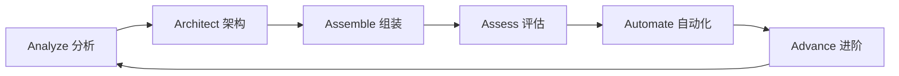

# 6A工作流提示词

## 概述

6A工作流是一个完整的软件开发生命周期管理框架，涵盖了从需求分析到持续优化的全流程。每个"A"代表一个关键阶段，确保软件开发的高质量交付和持续改进。

## 6A工作流框架



---

## A1: Analyze (分析阶段)

### 阶段目标
深入理解业务需求，进行技术可行性分析，为后续开发奠定坚实基础。

### 核心职责
- **需求分析**：理解业务背景、用户故事、功能需求
- **技术调研**：评估技术选型、框架选择、工具选型
- **可行性分析**：技术难度评估、资源评估、风险分析
- **范围界定**：功能边界、性能要求、约束条件

### 输出物
- 需求分析文档 (PRD)
- 技术调研报告
- 可行性分析报告
- 项目范围说明书

### 关键检查点
- [ ] 业务需求是否清晰完整
- [ ] 技术方案是否可行
- [ ] 风险点是否识别到位
- [ ] 项目范围是否明确

### 提示词模板
```
作为A1阶段分析师，请帮我进行[项目/功能]的深度分析：

1. 业务背景：[描述业务场景和目标用户]
2. 功能需求：[详细列出功能点]
3. 非功能性需求：[性能、安全、可用性等]
4. 约束条件：[时间、资源、技术限制]
5. 成功标准：[如何判断项目成功]

请输出：
- 需求优先级排序
- 技术可行性评估
- 潜在风险识别
- 建议的技术方案
```

---

## A2: Architect (架构阶段)

### 阶段目标
设计合理的系统架构，制定技术规范，确保系统的可扩展性和维护性。

### 核心职责
- **系统设计**：整体架构设计、模块划分、接口设计
- **技术选型**：框架选择、数据库选择、中间件选择
- **规范制定**：编码规范、接口规范、文档规范
- **架构评估**：性能分析、可扩展性分析、安全性分析

### 输出物
- 系统架构设计文档
- 技术选型报告
- 接口设计文档
- 数据库设计文档

### 关键检查点
- [ ] 架构设计是否合理
- [ ] 技术选型是否恰当
- [ ] 接口设计是否清晰
- [ ] 数据库设计是否规范

### 提示词模板
```
作为A2阶段架构师，请为[项目/功能]设计系统架构：

1. 功能模块：[列出主要模块]
2. 业务复杂度：[描述业务复杂度]
3. 性能要求：[并发量、响应时间等]
4. 扩展需求：[未来扩展方向]
5. 约束条件：[技术约束、资源约束]

请输出：
- 整体架构图
- 模块划分方案
- 技术栈选型
- 数据库设计
- 接口设计规范
- 部署架构
```

---

## A3: Assemble (组装阶段)

### 阶段目标
按照设计规范进行编码实现，确保代码质量和功能完整性。

### 核心职责
- **编码实现**：按照架构设计进行编码
- **模块开发**：独立开发各个功能模块
- **功能集成**：模块间集成测试
- **代码质量**：遵循编码规范，编写注释

### 输出物
- 功能完整的代码实现
- 单元测试代码
- 接口文档
- 部署脚本

### 关键检查点
- [ ] 功能实现是否完整
- [ ] 代码质量是否达标
- [ ] 单元测试覆盖率是否满足要求
- [ ] 编码规范是否遵循

### 提示词模板
```
作为A3阶段开发工程师，请实现[功能模块]：

1. 功能描述：[详细功能说明]
2. 接口定义：[输入输出规范]
3. 业务规则：[具体业务逻辑]
4. 异常处理：[异常场景处理]
5. 性能要求：[响应时间、并发要求]

请输出：
- 核心代码实现
- 单元测试用例
- 异常处理逻辑
- 性能优化方案
- 代码注释和文档
```

### 编码规范

#### Java开发规范
```java
// 1. 命名规范
@Service
public class UserService {
    
    private static final Logger log = LoggerFactory.getLogger(UserService.class);
    
    private static final int MAX_RETRY_TIMES = 3;
    
    /**
     * 根据用户ID获取用户信息
     * 
     * @param userId 用户ID，不能为空
     * @return 用户信息，如果用户不存在返回null
     * @throws IllegalArgumentException 当userId为空时抛出
     */
    public UserDTO getUserById(Long userId) {
        if (userId == null) {
            throw new IllegalArgumentException("用户ID不能为空");
        }
        
        log.info("开始获取用户信息, userId={}", userId);
        
        try {
            User user = userRepository.findById(userId)
                .orElseThrow(() -> new UserNotFoundException("用户不存在"));
            
            UserDTO result = convertToDTO(user);
            log.info("用户信息获取成功, userId={}, userName={}", userId, result.getName());
            
            return result;
        } catch (Exception e) {
            log.error("获取用户信息失败, userId={}", userId, e);
            throw new SystemException("系统异常", e);
        }
    }
    
    private UserDTO convertToDTO(User user) {
        return UserDTO.builder()
            .id(user.getId())
            .name(user.getName())
            .email(user.getEmail())
            .build();
    }
}
```

#### 数据库设计规范
```sql
-- 用户表
CREATE TABLE `user` (
    `id` bigint(20) NOT NULL AUTO_INCREMENT COMMENT '用户ID',
    `name` varchar(100) NOT NULL COMMENT '用户姓名',
    `email` varchar(200) NOT NULL COMMENT '邮箱地址',
    `phone` varchar(20) DEFAULT NULL COMMENT '手机号',
    `status` tinyint(2) NOT NULL DEFAULT '1' COMMENT '状态：1-启用，0-禁用',
    `create_time` datetime NOT NULL DEFAULT CURRENT_TIMESTAMP COMMENT '创建时间',
    `update_time` datetime NOT NULL DEFAULT CURRENT_TIMESTAMP ON UPDATE CURRENT_TIMESTAMP COMMENT '更新时间',
    PRIMARY KEY (`id`),
    UNIQUE KEY `uk_email` (`email`),
    KEY `idx_status` (`status`)
) ENGINE=InnoDB DEFAULT CHARSET=utf8mb4 COMMENT='用户表';
```

---

## A4: Assess (评估阶段)

### 阶段目标
全面评估代码质量和系统性能，确保满足质量标准。

### 核心职责
- **代码审查**：代码质量审查、安全性审查、性能审查
- **质量评估**：功能测试、集成测试、性能测试
- **安全评估**：安全漏洞扫描、权限验证、数据保护
- **性能评估**：压力测试、性能分析、优化建议

### 输出物
- 代码审查报告
- 测试报告
- 性能测试报告
- 安全评估报告

### 关键检查点
- [ ] 代码质量是否达标
- [ ] 功能测试是否通过
- [ ] 性能指标是否满足
- [ ] 安全漏洞是否修复

### 提示词模板
```
作为A4阶段质量评估师，请对[功能模块]进行全面评估：

1. 评估范围：[需要评估的功能点]
2. 质量标准：[质量要求指标]
3. 性能指标：[响应时间、吞吐量等]
4. 安全要求：[安全检查项]
5. 风险等级：[高/中/低风险]

请输出：
- 代码质量评分
- 功能测试结果
- 性能测试报告
- 安全评估报告
- 改进建议
```

### 代码审查清单

#### 功能性审查
- [ ] 功能是否按需求实现
- [ ] 边界条件是否处理
- [ ] 异常场景是否覆盖
- [ ] 业务逻辑是否正确

#### 代码质量审查
- [ ] 命名是否规范清晰
- [ ] 方法是否职责单一
- [ ] 代码是否易于理解
- [ ] 是否存在重复代码

#### 性能审查
- [ ] 是否存在性能瓶颈
- [ ] 数据库查询是否优化
- [ ] 内存使用是否合理
- [ ] 并发处理是否正确

#### 安全审查
- [ ] 输入验证是否充分
- [ ] 权限控制是否严格
- [ ] 敏感数据是否加密
- [ ] SQL注入风险是否避免

---

## A5: Automate (自动化阶段)

### 阶段目标
建立自动化流程，提高开发效率和交付质量。

### 核心职责
- **自动化测试**：单元测试、集成测试、端到端测试
- **CI/CD**：持续集成、持续部署流程
- **监控告警**：系统监控、性能监控、错误告警
- **自动化运维**：自动化部署、备份、恢复

### 输出物
- 自动化测试脚本
- CI/CD配置文件
- 监控配置
- 运维脚本

### 关键检查点
- [ ] 自动化测试是否覆盖核心功能
- [ ] CI/CD流程是否顺畅
- [ ] 监控告警是否及时
- [ ] 部署流程是否可靠

### 提示词模板
```
作为A5阶段自动化工程师，请建立[项目/模块]的自动化流程：

1. 测试需求：[需要自动化的测试类型]
2. 部署环境：[开发/测试/生产环境]
3. 监控指标：[需要监控的性能指标]
4. 告警规则：[告警触发条件]
5. 运维要求：[自动化运维需求]

请输出：
- 自动化测试方案
- CI/CD pipeline配置
- 监控告警配置
- 自动化运维脚本
```

### CI/CD配置示例

#### Maven项目CI/CD
```yaml
# .gitlab-ci.yml
stages:
  - test
  - build
  - deploy

variables:
  MAVEN_OPTS: "-Dmaven.repo.local=$CI_PROJECT_DIR/.m2/repository"
  MAVEN_CLI_OPTS: "--batch-mode --errors --fail-at-end --show-version"

test:
  stage: test
  script:
    - mvn $MAVEN_CLI_OPTS clean test
  coverage: '/Code coverage: \d+\.\d+%/'
  artifacts:
    reports:
      junit: target/surefire-reports/TEST-*.xml
      coverage_report:
        coverage_format: jacoco
        path: target/site/jacoco/jacoco.xml

build:
  stage: build
  script:
    - mvn $MAVEN_CLI_OPTS clean package -DskipTests
  artifacts:
    paths:
      - target/*.jar
    expire_in: 1 week

deploy:
  stage: deploy
  script:
    - echo "Deploying to production..."
    - ./deploy.sh
  only:
    - master
```

#### Docker部署配置
```dockerfile
# Dockerfile
FROM openjdk:8-jdk-alpine

VOLUME /tmp

COPY target/fssc-*.jar app.jar

EXPOSE 8080

ENTRYPOINT ["java", "-Djava.security.egd=file:/dev/./urandom", "-jar", "/app.jar"]
```

---

## A6: Advance (进阶阶段)

### 阶段目标
持续优化改进，技术沉淀分享，推动团队能力提升。

### 核心职责
- **性能优化**：系统性能调优、资源使用优化
- **技术沉淀**：最佳实践总结、技术方案优化
- **知识分享**：技术分享、文档更新、培训
- **持续改进**：流程优化、工具改进、标准制定

### 输出物
- 性能优化报告
- 技术分享文档
- 最佳实践指南
- 改进建议方案

### 关键检查点
- [ ] 性能是否持续优化
- [ ] 最佳实践是否沉淀
- [ ] 知识是否有效分享
- [ ] 流程是否持续改进

### 提示词模板
```
作为A6阶段技术专家，请对[项目/系统]进行进阶优化：

1. 当前状态：[系统现状和性能指标]
2. 优化目标：[期望达到的性能目标]
3. 改进领域：[性能/可维护性/可扩展性]
4. 资源约束：[时间、人力、技术约束]
5. 推广价值：[对其他项目的参考价值]

请输出：
- 性能优化方案
- 最佳实践总结
- 技术分享材料
- 改进建议和推广方案
```

### 性能优化指南

#### 数据库优化
```sql
-- 1. 索引优化
CREATE INDEX idx_user_email ON user(email);
CREATE INDEX idx_order_status_create_time ON `order`(status, create_time);

-- 2. 查询优化
-- ❌ 避免SELECT *
SELECT id, name, email FROM user WHERE id = ?;

-- ❌ 避免LIKE '%keyword%'
SELECT * FROM product WHERE name LIKE 'keyword%';

-- ✅ 使用LIMIT分页
SELECT * FROM user ORDER BY create_time DESC LIMIT ?, ?;
```

#### 缓存优化
```java
@Service
public class UserService {
    
    @Cacheable(value = "user", key = "#userId")
    public UserDTO getUserById(Long userId) {
        // 从数据库查询用户信息
        return userRepository.findById(userId)
            .map(this::convertToDTO)
            .orElse(null);
    }
    
    @CacheEvict(value = "user", key = "#userId")
    public void updateUser(Long userId, UserUpdateDTO updateDTO) {
        // 更新用户信息
    }
}
```

#### JVM调优
```bash
# 生产环境JVM参数
java -Xms2g -Xmx2g \
     -XX:+UseG1GC \
     -XX:MaxGCPauseMillis=200 \
     -XX:+UseStringDeduplication \
     -jar application.jar
```

---

## 工作流执行指南

### 阶段转换标准

#### A1 → A2 转换条件
- [ ] 需求文档评审通过
- [ ] 技术可行性确认
- [ ] 项目范围明确
- [ ] 风险评估完成

#### A2 → A3 转换条件
- [ ] 架构设计评审通过
- [ ] 技术选型确认
- [ ] 接口规范制定
- [ ] 开发环境准备

#### A3 → A4 转换条件
- [ ] 功能开发完成
- [ ] 单元测试通过
- [ ] 代码自测通过
- [ ] 集成测试通过

#### A4 → A5 转换条件
- [ ] 代码审查通过
- [ ] 功能测试通过
- [ ] 性能测试通过
- [ ] 安全测试通过

#### A5 → A6 转换条件
- [ ] 自动化测试就绪
- [ ] CI/CD流程建立
- [ ] 监控告警配置
- [ ] 部署流程稳定

#### A6 → A1 转换条件
- [ ] 优化改进完成
- [ ] 最佳实践总结
- [ ] 知识分享完成
- [ ] 下期需求准备

### 质量门禁

#### 每个阶段的质量标准
- **A1阶段**：需求完整性≥95%，技术可行性100%
- **A2阶段**：架构合理性≥90%，技术选型合理性100%
- **A3阶段**：代码质量≥85%，单元测试覆盖率≥80%
- **A4阶段**：功能测试通过率100%，性能达标率100%
- **A5阶段**：自动化覆盖率≥90%，CI/CD成功率≥95%
- **A6阶段**：性能提升≥10%，知识分享覆盖率≥80%

### 风险管控

#### 各阶段风险识别
- **A1风险**：需求变更、技术选型失误
- **A2风险**：架构设计缺陷、技术债务
- **A3风险**：开发延期、代码质量问题
- **A4风险**：测试覆盖不足、性能不达标
- **A5风险**：自动化失败、部署问题
- **A6风险**：优化效果不佳、推广困难

#### 风险应对策略
1. **预防为主**：每个阶段充分评审，降低风险
2. **及时发现**：建立监控告警机制
3. **快速响应**：制定应急处理预案
4. **持续改进**：总结经验，完善流程

---

## 最佳实践总结

### 成功要素
1. **明确目标**：每个阶段都有清晰的产出物和检查标准
2. **严格把控**：质量门禁确保每个阶段输出质量
3. **持续改进**：A6阶段确保流程和技术的持续优化
4. **团队协作**：各阶段团队密切配合，信息透明

### 常见问题
1. **阶段跳跃**：跳过必要的评审和检查环节
2. **质量妥协**：为了进度降低质量标准
3. **文档缺失**：缺乏必要的文档和记录
4. **反馈滞后**：问题发现太晚，修复成本高

### 改进建议
1. **标准化**：建立标准化的模板和检查清单
2. **工具化**：利用工具提高效率和质量
3. **自动化**：尽可能自动化重复性工作
4. **可视化**：通过可视化工具监控流程状态

---

## 使用说明

### 提示词使用方式
1. **复制模板**：根据当前阶段选择合适的提示词模板
2. **替换变量**：将模板中的[变量]替换为实际内容
3. **补充细节**：根据具体情况补充相关信息
4. **生成输出**：AI助手将生成专业的分析和建议

### 自定义扩展
1. **领域定制**：根据不同业务领域调整重点
2. **规模适配**：根据项目规模调整详细程度
3. **工具集成**：结合具体开发工具进行适配
4. **标准更新**：根据技术发展和最佳实践更新

### 质量保证
1. **模板验证**：定期验证模板的有效性
2. **反馈收集**：收集使用反馈，持续改进
3. **案例积累**：积累成功案例，指导实践
4. **标准演进**：随着技术发展更新标准

---

*本提示词基于业界最佳实践和团队实际经验总结，旨在提升软件开发质量和效率。*