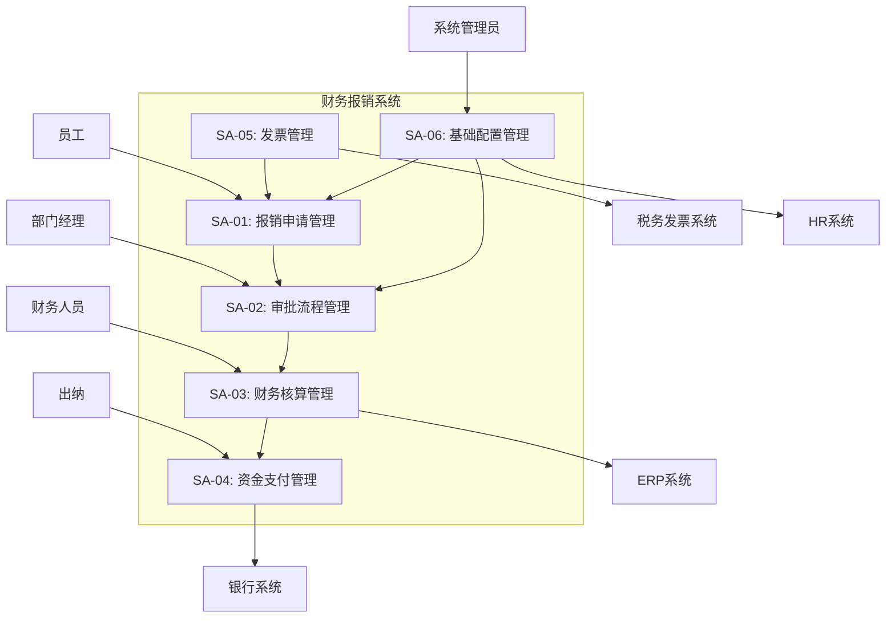
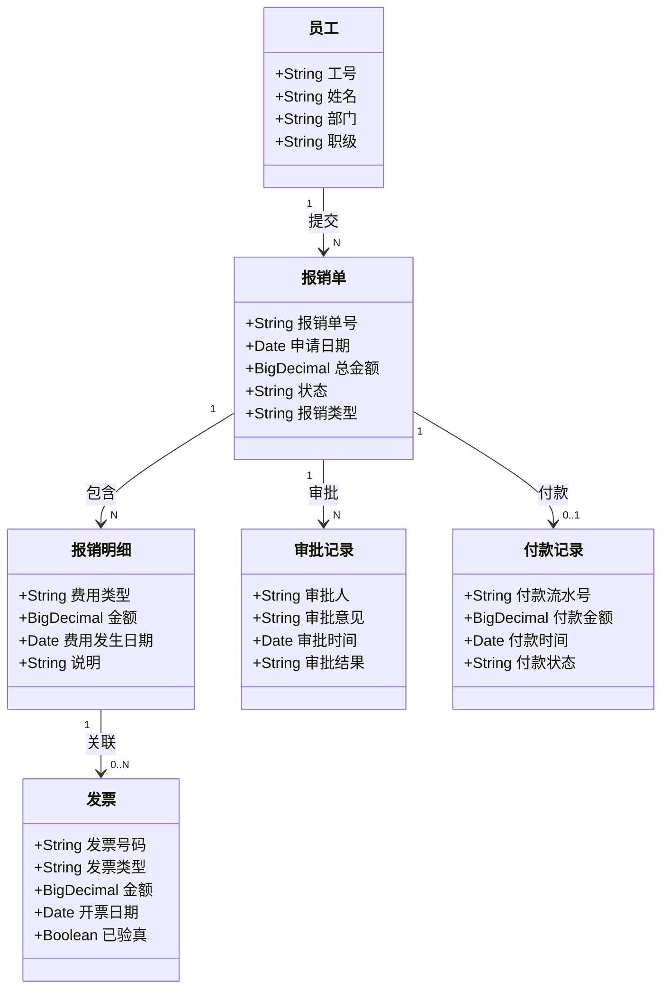
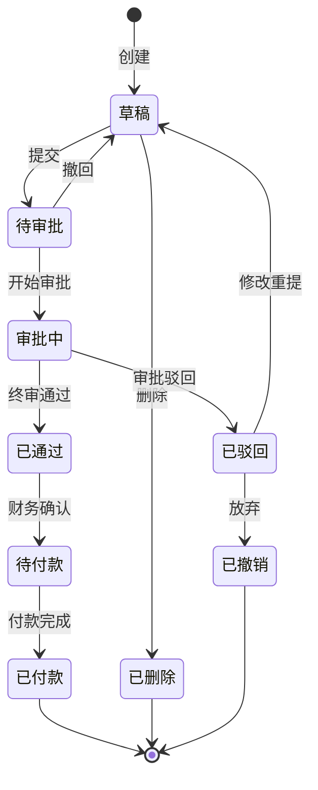

# 财务报销系统 SERU 分析示例

> 以"财务报销系统"为例，展示完整的 SERU 分析过程和交付物。

---

## 项目背景

某集团企业需要建设统一的财务报销系统，替换原有的线下纸质报销流程。系统需要覆盖差旅报销、日常费用报销、采购报销等场景，支持多级审批、发票验真、银行付款等功能。

---

## 阶段一：需求定义

### 1. 主题域划分

| 编号 | 主题域名称 | 业务职责描述 | 主要角色 |
|------|-----------|------------|---------|
| SA-01 | 报销申请管理 | 管理报销单的创建、编辑、提交 | 申请人 |
| SA-02 | 审批流程管理 | 管理报销单的多级审批流转 | 审批人、部门经理 |
| SA-03 | 财务核算管理 | 管理报销单的财务审核、记账 | 财务人员 |
| SA-04 | 资金支付管理 | 管理报销款项的付款和银企对接 | 出纳 |
| SA-05 | 发票管理 | 管理发票的录入、验真、抵扣 | 申请人、财务人员 |
| SA-06 | 基础配置管理 | 管理费用类型、审批规则、预算等基础配置 | 系统管理员 |

### 系统边界图

### 2. 业务事件列表（SA-01 报销申请管理）

| 编号 | 业务事件名称 | 触发类型 | 触发条件 | 参与角色 | 优先级 |
|------|-----------|---------|---------|---------|------|
| E-01 | 创建报销单 | 外部 | 员工需要报销费用 | 申请人 | 高 |
| E-02 | 编辑报销单 | 外部 | 申请人修改草稿报销单 | 申请人 | 高 |
| E-03 | 提交报销单 | 外部 | 申请人确认信息无误后提交 | 申请人 | 高 |
| E-04 | 撤回报销单 | 外部 | 申请人在审批前撤回 | 申请人 | 中 |
| E-05 | 删除报销单 | 外部 | 申请人删除草稿报销单 | 申请人 | 中 |
| E-06 | 查询报销记录 | 外部 | 申请人查看历史报销 | 申请人 | 中 |

### 3. 报表列表

| 编号 | 报表名称 | 使用场景 | 查看角色 | 频率 |
|------|---------|---------|---------|------|
| R-01 | 部门报销汇总表 | 管理层查看部门报销总额 | 部门经理、财务 | 月 |
| R-02 | 个人报销明细表 | 员工查看个人报销历史 | 申请人 | 按需 |
| R-03 | 报销审批效率报表 | 管理层监控审批时效 | 管理层 | 周 |
| R-04 | 费用类型分析报表 | 财务分析费用结构 | 财务总监 | 月 |

---

## 阶段二：需求捕获

### 领域模型

### 报销单状态流转

---

## 阶段三：需求分析

### 用例规格示例：UC-03 提交报销单

**所属主题域**：SA-01 报销申请管理
**触发业务事件**：E-03 提交报销单
**主要参与者**：申请人
**优先级**：高

#### 简述

申请人将已填写完整的报销单提交至审批流程，发起报销审批。

#### 前置条件

- 申请人已登录系统
- 报销单处于"草稿"状态
- 报销单已关联至少一张发票

#### 主成功场景

| 步骤 | 参与者/系统 | 动作描述 |
|------|-----------|---------|
| 1 | 申请人 | 在报销单列表中选择一张草稿状态的报销单 |
| 2 | 系统 | 展示报销单详情页面 |
| 3 | 申请人 | 确认报销信息无误，点击"提交"按钮 |
| 4 | 系统 | 校验报销单必填字段（金额、费用类型、发票） |
| 5 | 系统 | 调用发票验真服务，验证所有关联发票 |
| 6 | 系统 | 根据费用类型和金额匹配审批规则，确定审批链 |
| 7 | 系统 | 将报销单状态变更为"待审批"，发起审批流程 |
| 8 | 系统 | 向第一级审批人发送审批通知 |
| 9 | 系统 | 向申请人显示"提交成功"提示 |

#### 扩展场景

| 分支点 | 条件 | 处理方式 |
|--------|------|---------|
| 4a | 必填字段缺失 | 系统高亮显示缺失字段，提示"请补充必填信息" |
| 5a | 发票验真失败 | 系统标记问题发票，提示"以下发票验真未通过"，阻止提交 |
| 5b | 发票验真服务不可用 | 系统记录待验真状态，允许提交但标记"待验真" |
| 6a | 无匹配的审批规则 | 系统提示"无法确定审批链，请联系管理员" |
| 6b | 报销金额超过预算 | 系统提示"已超出部门预算，需额外审批" |

#### 后置条件

**成功后**：
- 报销单状态变为"待审批"
- 审批流程已创建
- 第一级审批人已收到通知

**失败后**：
- 报销单保持"草稿"状态
- 无审批流程创建

#### 业务规则

| 编号 | 规则描述 | 校验时机 |
|------|---------|---------|
| BR-01 | 报销金额不能超过发票金额总和 | 步骤4 |
| BR-02 | 同一张发票不能关联到多张报销单 | 步骤4 |
| BR-03 | 差旅报销必须附行程单 | 步骤4 |
| BR-04 | 单笔报销金额超过5000元需总监审批 | 步骤6 |

#### 非功能性需求

| 类别 | 指标 |
|------|------|
| 性能 | 提交操作响应时间 < 3秒 |
| 并发 | 支持100人同时提交 |
| 安全 | 提交操作记录审计日志 |

---

## 追溯矩阵（摘要）

| 业务目标 | 主题域 | 业务事件 | 用例 |
|---------|--------|---------|------|
| G-01: 提升报销效率 | SA-01 | E-01, E-02, E-03 | UC-01, UC-02, UC-03 |
| G-02: 规范审批流程 | SA-02 | E-07, E-08, E-09 | UC-07, UC-08, UC-09 |
| G-03: 保障财务合规 | SA-03, SA-05 | E-10, E-15 | UC-10, UC-15 |
| G-04: 加速资金到账 | SA-04 | E-12, E-13 | UC-12, UC-13 |

---

## 分析总结

此示例展示了 SERU 方法的完整应用：

1. **阶段一（定义）**：通过主题域划分和业务事件识别，建立了系统全景
2. **阶段二（捕获）**：通过领域模型和状态图，理清了数据关系和业务脉络
3. **阶段三（分析）**：通过用例详述，填充了交互细节和业务规则

**关键成果**：
- 6个主题域，覆盖完整业务链条
- 20+个业务事件，确保场景无遗漏
- 4个报表需求，满足管理决策需要
- 完整的追溯链路：目标→主题域→事件→用例
