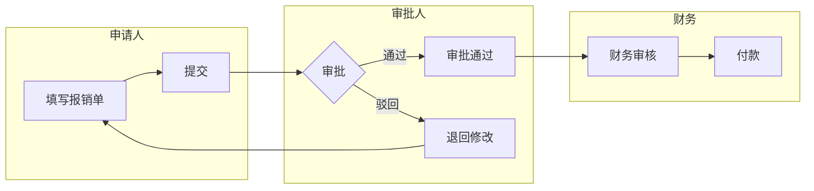

# 四条主线分析法（人、事、物、接口）

> 需求分析的四条主线，确保从多个维度全面覆盖需求，不遗漏关键信息。

---

## 概述

四条主线是 SERU 框架中用于**系统性检查需求完整性**的分析方法。通过"人、事、物、接口"四个维度交叉分析，确保需求无死角。

```
        ┌─── 人 ───┐
        │          │
    接口 ─── 系统 ─── 事
        │          │
        └─── 物 ───┘
```

---

## 1. 人（角色/干系人）

### 1.1 分析目标

回答：**谁使用系统？谁受系统影响？谁提供信息？**

### 1.2 分析方法

**Step 1: 识别直接用户**

| 分类 | 分析问题 | 示例 |
|------|---------|------|
| 主要用户 | 谁直接使用系统完成日常工作？ | 报销申请人、审批人 |
| 次要用户 | 谁偶尔使用系统或使用部分功能？ | 财务经理（查看报表） |
| 管理用户 | 谁负责系统配置和维护？ | 系统管理员 |

**Step 2: 识别间接干系人**

| 分类 | 分析问题 | 示例 |
|------|---------|------|
| 决策者 | 谁基于系统输出做决策？ | 财务总监 |
| 受影响方 | 谁受系统处理结果影响？ | 供应商（等待付款） |
| 监管方 | 谁对系统有合规性要求？ | 审计部门、税务机关 |

**Step 3: 角色-权限矩阵**

| 角色 | 可见范围 | 操作权限 | 审批权限 | 数据范围 |
|------|---------|---------|---------|---------|
| [角色] | [功能模块] | 增/删/改/查 | 是/否 | 部门/全公司 |

### 1.3 检查清单

- [ ] 所有直接用户角色已识别
- [ ] 所有间接干系人已识别
- [ ] 每个角色有明确的权限边界
- [ ] 角色之间的组织关系已明确（上下级、协作关系）

---

## 2. 事（业务事件/流程）

### 2.1 分析目标

回答：**发生了什么业务动作？流程如何流转？有哪些异常情况？**

### 2.2 分析方法

**Step 1: 识别业务事件**

| 触发类型 | 识别方法 | 示例 |
|---------|---------|------|
| 外部触发 | 用户主动发起的操作 | 提交报销单、审批报销单 |
| 内部触发 | 系统内部联动 | 审批通过后自动生成付款单 |
| 时间触发 | 定时或周期性 | 每月自动汇总报销数据 |

**Step 2: 流程分析**

```
对每个业务事件，分析:
1. 正常流程（主成功场景）
2. 异常流程（各种异常分支）
3. 并行流程（是否有并发处理）
4. 条件分支（不同条件走不同路径）
```

**Step 3: 泳道流程图**



### 2.3 检查清单

- [ ] 所有业务事件已识别（外部/内部/时间触发）
- [ ] 每个事件的正常流程已描述
- [ ] 异常和边界场景已覆盖
- [ ] 事件间的前后依赖关系已明确

---

## 3. 物（业务实体/数据）

### 3.1 分析目标

回答：**涉及哪些核心数据？数据之间什么关系？数据如何流转？**

### 3.2 分析方法

**Step 1: 识别核心业务实体**

| 来源 | 识别方法 |
|------|---------|
| 从业务事件中提取 | 事件操作的对象就是实体（如"提交报销单"→ 报销单） |
| 从用户描述中提取 | 用户口中的名词往往是实体 |
| 从表单/界面中提取 | 界面上显示的数据对应实体属性 |

**Step 2: 分析实体关系**

```
关系类型:
- 1:1 (一对一) — 如: 用户↔身份证信息
- 1:N (一对多) — 如: 报销单↔报销明细行
- N:N (多对多) — 如: 用户↔角色
```

**Step 3: 分析数据生命周期**

```
创建 → 使用/修改 → 审核 → 归档 → 销毁
  ↑       ↑         ↑       ↑       ↑
谁创建？ 谁修改？  谁审核？ 何时归档？ 保留多久？
```

### 3.3 检查清单

- [ ] 所有核心业务实体已识别
- [ ] 实体的关键属性已定义
- [ ] 实体间的关系和基数已标注
- [ ] 数据的生命周期已明确
- [ ] 数据量已估算（影响技术设计）

---

## 4. 接口（外部系统/边界）

### 4.1 分析目标

回答：**系统与哪些外部系统交互？交互方式是什么？数据如何流转？**

### 4.2 分析方法

**Step 1: 识别外部系统**

| 接口类型 | 说明 | 示例 |
|---------|------|------|
| 上游系统 | 向本系统提供数据 | ERP系统提供组织架构数据 |
| 下游系统 | 接收本系统输出的数据 | 银行系统接收付款指令 |
| 平行系统 | 双向数据交互 | OA系统（审批流程联动） |
| 外部服务 | 第三方API调用 | 发票验真服务 |

**Step 2: 接口详情分析**

| 维度 | 分析内容 |
|------|---------|
| 交互方式 | REST API / MQ消息 / 文件传输 / 数据库直连 |
| 数据格式 | JSON / XML / CSV / 自定义协议 |
| 调用方向 | 主动调用 / 被动接收 / 双向 |
| 频率 | 实时 / 准实时 / 批量（日/周/月） |
| 数据量 | 单次数据量 / 峰值并发量 |
| 安全性 | 加密 / 签名 / 认证方式 |
| SLA | 可用性 / 响应时间 / 超时处理 |

### 4.3 检查清单

- [ ] 所有外部系统接口已识别
- [ ] 每个接口的交互方式已明确
- [ ] 接口的数据格式和协议已定义
- [ ] 异常处理策略已明确（超时、失败重试等）
- [ ] 接口的SLA要求已记录

---

## 5. 四条主线交叉分析

### 5.1 人×事 矩阵

> 每个角色参与了哪些业务事件？以什么方式参与？

| | E-01 | E-02 | E-03 | E-04 |
|---|------|------|------|------|
| 角色A | 发起 | — | 审批 | 查看 |
| 角色B | — | 发起 | — | 执行 |

### 5.2 事×物 矩阵

> 每个业务事件操作了哪些数据实体？什么操作？

| | 实体A | 实体B | 实体C |
|---|------|-------|-------|
| E-01 | 创建 | — | 查询 |
| E-02 | 修改 | 创建 | — |

### 5.3 物×接口 矩阵

> 哪些数据实体涉及外部系统交互？

| | 系统A | 系统B | 系统C |
|---|------|-------|-------|
| 实体A | 接收 | — | 发送 |
| 实体B | — | 同步 | — |

---

## 6. 使用建议

1. **项目启动时**先做四条主线的粗略分析，建立全景视图
2. **深入分析时**逐条主线细化，交叉检查完整性
3. **需求评审时**用四条主线作为检查框架，确保无遗漏
4. **需求变更时**从变更点出发，沿四条主线分析影响范围
