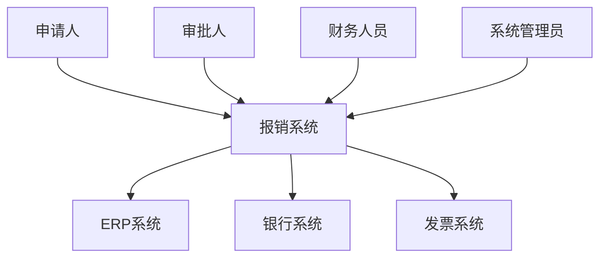
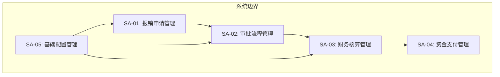
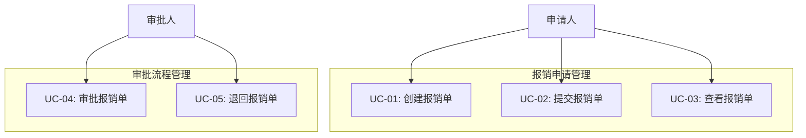
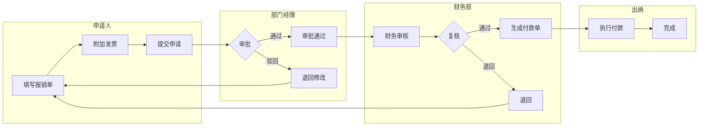
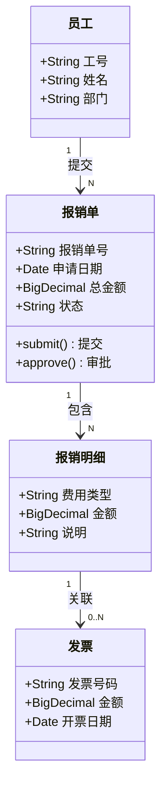
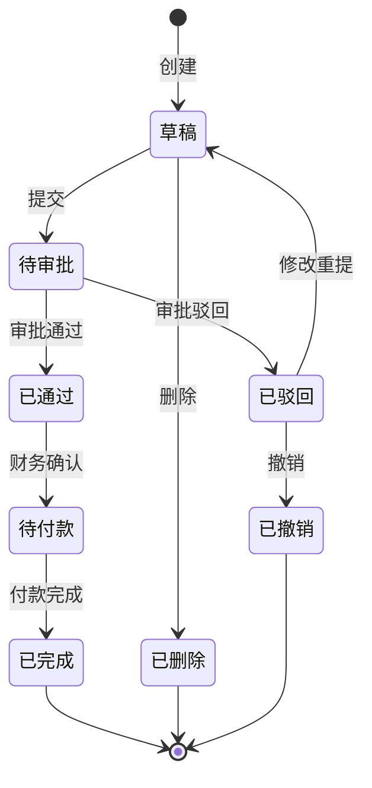
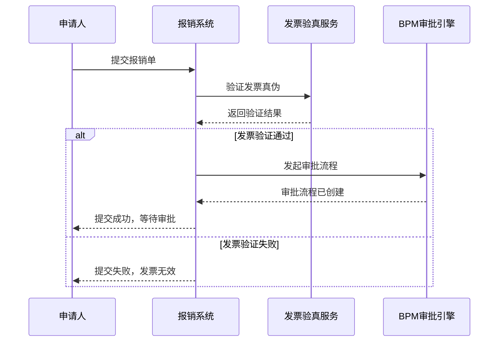

# 需求建模图谱指南

> UML 建模在 SERU 各阶段的应用指南，包含 Mermaid 语法示例。

---

## 概述

需求建模通过可视化方式表达需求，弥补自然语言的模糊性。不同阶段使用不同的模型：

| SERU 阶段 | 建模目标 | 推荐模型 | Mermaid 类型 |
|-----------|---------|---------|-------------|
| 需求定义 | 系统边界和主题域 | 系统上下文图 | `graph TB` |
| 需求定义 | 用例概览 | 用例图 | `graph TB` |
| 需求捕获 | 业务流程 | 泳道流程图 | `graph LR` + subgraph |
| 需求捕获 | 数据关系 | 领域类图 / ER图 | `classDiagram` |
| 需求分析 | 对象生命周期 | 状态机图 | `stateDiagram-v2` |
| 需求分析 | 系统交互 | 时序图 | `sequenceDiagram` |

---

## 1. 系统上下文图

### 适用场景
- 项目启动阶段，明确系统边界
- 识别外部参与者和外部系统

### Mermaid 示例

### 建模要点
- 中间是目标系统（一个节点）
- 左侧是人（角色），右侧是外部系统
- 箭头表示交互方向
- 不画系统内部细节

---

## 2. 主题域关系图

### 适用场景
- 主题域划分后，展示域间关系

### Mermaid 示例

### 建模要点
- 使用 subgraph 包裹系统边界
- 箭头表示数据/业务依赖方向
- 不加颜色和样式

---

## 3. 用例图

### 适用场景
- 展示系统功能概览和角色关系

### Mermaid 示例

### 建模要点
- 按主题域分组
- 角色在图的左侧
- 用例用矩形节点表示（Mermaid 不支持椭圆）

---

## 4. 泳道流程图（业务流程图）

### 适用场景
- 跨角色的业务事件流程
- 展示业务流转和决策分支

### Mermaid 示例

### 建模要点
- 每个 subgraph 代表一个角色/泳道
- 菱形节点表示决策分支
- 注意异常流程的回路

---

## 5. 领域类图

### 适用场景
- 核心业务实体和关系建模
- 数据需求分析

### Mermaid 示例

### 建模要点
- 属性使用业务名称，不用技术字段名
- 标注关系基数（1, N, 0..N, 0..1）
- 方法只列核心业务操作

---

## 6. 状态机图

### 适用场景
- 单据/对象的生命周期
- 状态流转和触发条件

### Mermaid 示例

### 建模要点
- 用 `[*]` 表示起始和结束
- 每个转换标注触发条件
- 覆盖所有合法的状态转换路径

---

## 7. 时序图

### 适用场景
- 系统间交互
- 复杂用例的内部流程

### Mermaid 示例

### 建模要点
- participant 声明参与者
- `->>` 表示同步调用，`-->>` 表示返回
- 使用 `alt/else/end` 表示分支

---

## 建模原则

1. **业务视角优先**：模型服务于业务理解，不是技术实现
2. **适度抽象**：不要画得太细，保持在需求层面
3. **一致性**：同一实体在不同图中保持名称一致
4. **无样式**：使用基本 Mermaid 语法，不加颜色和 CSS
5. **配合文字**：模型配合文字说明，不能只有图没有解释
