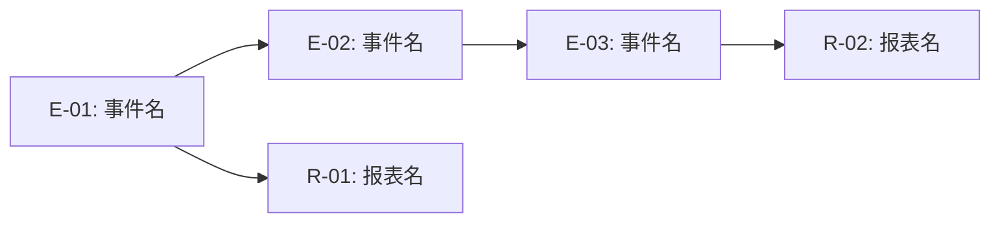

# 业务事件列表模板

> SERU 阶段一/二交付物 — 识别主题域下所有业务事件和报表需求。

---

## 业务事件列表 EL-[编号]

**所属主题域**：SA-[XX] [主题域名称]
**分析日期**：[YYYY-MM-DD]
**分析人员**：[姓名]
**版本**：v[X.X]

---

### 1. 业务事件清单

| 编号 | 业务事件名称 | 触发类型 | 触发条件 | 参与角色 | 所属主题域 | 优先级 | 频率 |
|------|-----------|---------|---------|---------|----------|------|------|
| E-01 | [动词+名词] | 外部/内部/时间 | [具体触发条件] | [角色列表] | SA-[XX] | 高/中/低 | [日/周/月/事件驱动] |
| E-02 | [动词+名词] | [类型] | [条件] | [角色] | SA-[XX] | 高/中/低 | [频率] |
| E-03 | [动词+名词] | [类型] | [条件] | [角色] | SA-[XX] | 高/中/低 | [频率] |

**触发类型说明**：
- **外部触发**：由外部参与者主动发起（如用户点击按钮）
- **内部触发**：由系统内部其他事件联动触发（如订单确认后自动生成发票）
- **时间触发**：由定时任务或时间节点触发（如每月1日自动生成报表）

---

### 2. 业务事件详情

#### E-[XX]：[事件名称]

**基本信息**：

| 属性 | 描述 |
|------|------|
| 事件名称 | [动词+名词格式] |
| 触发类型 | 外部/内部/时间 |
| 触发条件 | [具体前提条件] |
| 主要参与者 | [角色名] |
| 输入数据 | [需要的输入信息] |
| 输出数据 | [产出的信息/状态变化] |
| 业务规则 | [需要遵循的业务规则] |
| 频率 | [发生频率估算] |
| 关联事件 | [前序事件/后续事件] |

**业务流程概要**：
1. [步骤1]
2. [步骤2]
3. [步骤3]

**异常情况**：
- [异常1：条件 → 处理方式]
- [异常2：条件 → 处理方式]

> 复制此区块为每个核心业务事件填写详情。

---

### 3. 报表列表

| 编号 | 报表名称 | 使用场景 | 数据来源 | 查看角色 | 频率 | 格式 |
|------|---------|---------|---------|---------|------|------|
| R-01 | [报表名] | [使用场景描述] | [数据来源主题域/实体] | [角色] | [日/周/月/按需] | 在线/PDF/Excel |
| R-02 | [报表名] | [场景] | [来源] | [角色] | [频率] | [格式] |

---

### 4. 事件关系图

---

### 5. 事件-角色矩阵

| 业务事件 | 角色A | 角色B | 角色C | 角色D |
|---------|-------|-------|-------|-------|
| E-01 | 发起 | 审批 | — | 查看 |
| E-02 | — | 发起 | 执行 | — |
| E-03 | 查看 | — | 发起 | 审批 |

**参与方式**：发起 / 审批 / 执行 / 查看 / 通知

---

### 6. 填写指引

1. **事件命名**：统一使用"动词+名词"格式（如：提交报销单、审批付款申请）
2. **触发条件**：必须是可观测、可判断的条件，不能模糊
3. **参与角色**：列出所有参与该事件的角色，不只是发起者
4. **报表**：不仅包括打印报表，还包括在线查询、仪表盘、统计分析
5. **优先级**：高 = 核心业务必须、中 = 重要但非阻塞、低 = 锦上添花
6. **频率**：尽量量化（如"日均50次"），而非模糊描述
