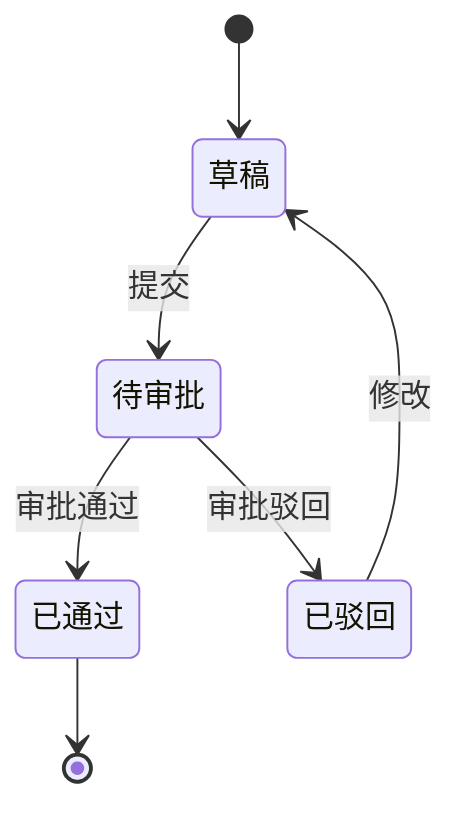
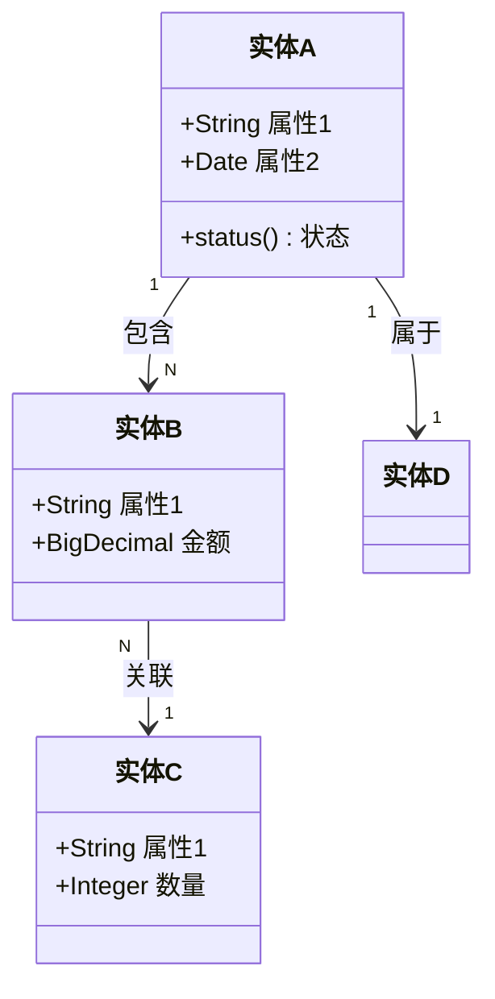

# 领域模型模板

> SERU 阶段二交付物 — 建立核心业务实体及其关系的领域模型。

---

## 领域模型 DM-[编号]

**分析范围**：[主题域名称 或 "全局"]
**所属主题域**：SA-[XX]（全局模型写"跨主题域"）
**分析日期**：[YYYY-MM-DD]
**分析人员**：[姓名]
**版本**：v[X.X]

---

### 1. 核心实体清单

| 编号 | 实体名称 | 业务描述 | 所属主题域 | 生命周期 | 数据量估算 |
|------|---------|---------|-----------|---------|-----------|
| EN-01 | [实体名] | [一句话描述业务含义] | SA-[XX] | [创建→使用→归档] | [日增量/总量] |
| EN-02 | [实体名] | [描述] | SA-[XX] | [生命周期] | [数据量] |
| EN-03 | [实体名] | [描述] | SA-[XX] | [生命周期] | [数据量] |

---

### 2. 实体属性明细

#### EN-[XX]：[实体名称]

| 属性名 | 类型 | 必填 | 业务含义 | 取值范围/约束 |
|--------|------|------|---------|-------------|
| [属性名] | 文本/数字/日期/枚举/布尔 | 是/否 | [业务含义] | [约束] |
| [属性名] | [类型] | [必填] | [含义] | [约束] |

**业务规则**：
- [规则1：涉及此实体的业务规则]
- [规则2]

**状态流转**（如有状态属性）：

> 复制此区块为每个核心实体填写属性明细。

---

### 3. 实体关系图

---

### 4. 实体关系矩阵

| | 实体A | 实体B | 实体C | 实体D |
|---|------|-------|-------|-------|
| **实体A** | — | 1:N 包含 | — | 1:1 属于 |
| **实体B** | N:1 属于 | — | N:1 关联 | — |
| **实体C** | — | 1:N 被关联 | — | — |
| **实体D** | 1:1 被属于 | — | — | — |

**关系类型**：1:1 / 1:N / N:N / 无关

---

### 5. 跨主题域数据流

> 描述实体在不同主题域之间的数据流转关系。

| 源主题域 | 目标主题域 | 数据实体 | 流转方式 | 触发条件 |
|---------|-----------|---------|---------|---------|
| SA-[XX] | SA-[XX] | [实体名] | 同步/异步/批量 | [触发事件] |

---

### 6. 填写指引

1. **实体命名**：使用业务语言命名，不使用技术术语（如"报销单"而非"t_claim"）
2. **属性类型**：使用业务视角描述类型，不用数据库字段类型
3. **关系**：必须标注关系方向和基数（1:1, 1:N, N:N）
4. **状态流转**：对有生命周期的实体，必须画状态图
5. **数据量估算**：帮助后续技术设计做容量规划
6. **跨域数据流**：识别数据在不同主题域间的流转，避免数据孤岛
