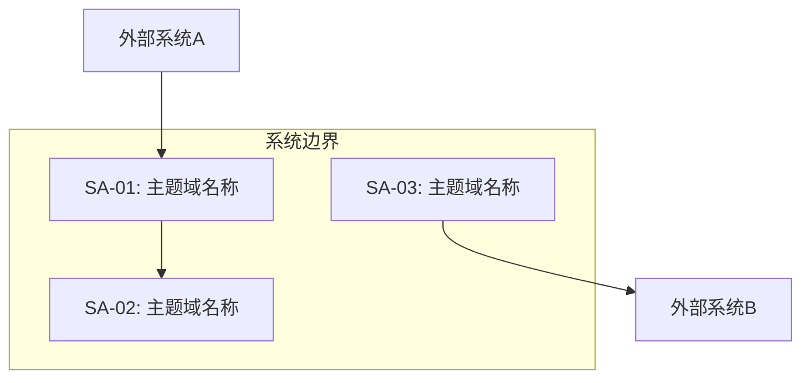

# 需求规格说明书模板（SRS）

> SERU 全阶段交付物 — 完整的软件需求规格说明书，按业务主题域组织。

---

## 需求规格说明书

**项目名称**：[项目名称]
**文档版本**：v[X.X]
**编制日期**：[YYYY-MM-DD]
**编制人员**：[姓名]
**审核人员**：[姓名]
**批准人员**：[姓名]

---

### 1. 引言

#### 1.1 目的

> [说明本文档的目的、预期读者和使用范围]

#### 1.2 范围

**系统名称**：[系统全称]
**系统简称**：[缩写]

**系统范围**：
- 包含：[系统覆盖的业务范围]
- 不包含：[明确排除的内容]

**主题域范围**：

| 编号 | 主题域 | 是否在本期范围 |
|------|--------|-------------|
| SA-01 | [名称] | 是/否 |
| SA-02 | [名称] | 是/否 |

#### 1.3 术语定义

| 术语 | 定义 | 英文对照 |
|------|------|---------|
| [术语1] | [定义] | [English] |
| [术语2] | [定义] | [English] |

#### 1.4 参考文献

| 编号 | 文档名称 | 版本 | 说明 |
|------|---------|------|------|
| [1] | [文档名] | [版本] | [说明] |

#### 1.5 干系人列表

| 角色 | 代表人 | 核心关注点 | 参与阶段 |
|------|--------|-----------|---------|
| [角色] | [姓名] | [关注点] | [阶段] |

---

### 2. 系统概述

#### 2.1 业务背景

> [描述业务现状、存在的问题、建设本系统的业务驱动力]

#### 2.2 系统目标

| 编号 | 目标描述 | 量化指标 | 优先级 |
|------|---------|---------|-------|
| G-01 | [目标] | [指标] | 高/中/低 |

#### 2.3 主题域划分

> [引用主题域划分文档 SA-XX]

#### 2.4 系统上下文

> [描述系统与外部环境的交互关系]

---

### 3. 功能需求（按主题域组织）

#### 3.X [SA-XX: 主题域名称]

**主题域描述**：[一句话描述职责]

**业务事件列表**：

| 编号 | 业务事件 | 触发条件 | 参与角色 | 优先级 |
|------|---------|---------|---------|-------|
| E-XX | [事件名] | [条件] | [角色] | 高/中/低 |

**用例列表**：

| 编号 | 用例名称 | 触发事件 | 主要角色 | 优先级 | 复杂度 |
|------|---------|---------|---------|-------|-------|
| UC-XX | [名称] | E-[XX] | [角色] | 高/中/低 | 高/中/低 |

**用例规格**：

> [引用对应的用例规格文档 UC-XX，或直接在此展开]
> 参见 [UC-XX 用例规格](./use-cases/UC-XX.md)

> 为每个主题域重复此结构。

---

### 4. 数据需求

#### 4.1 全局领域类图

> [引用领域模型文档 DM-XX]

#### 4.2 核心业务数据说明

| 实体 | 描述 | 数据量估算 | 保留策略 |
|------|------|-----------|---------|
| [实体名] | [描述] | [日增/总量] | [保留X年] |

#### 4.3 数据迁移需求（如有）

| 源系统 | 目标实体 | 数据量 | 迁移策略 | 清洗规则 |
|--------|---------|-------|---------|---------|
| [源系统] | [实体] | [量] | [全量/增量] | [规则] |

---

### 5. 非功能性需求

#### 5.1 性能需求

| 编号 | 场景 | 指标 | 目标值 |
|------|------|------|-------|
| NFR-P01 | [场景描述] | 响应时间 | [< X秒] |
| NFR-P02 | [场景描述] | 吞吐量 | [X TPS] |
| NFR-P03 | [场景描述] | 并发用户数 | [X 人] |

#### 5.2 安全需求

| 编号 | 需求描述 | 级别 |
|------|---------|------|
| NFR-S01 | [安全需求] | 必须/建议 |

#### 5.3 可靠性需求

| 编号 | 需求描述 | 目标值 |
|------|---------|-------|
| NFR-R01 | 系统可用性 | [99.9%] |
| NFR-R02 | 数据备份恢复 | [RPO < X小时, RTO < X小时] |

#### 5.4 可维护性需求

| 编号 | 需求描述 |
|------|---------|
| NFR-M01 | [可维护性需求] |

---

### 6. 约束与假设

#### 6.1 技术约束

- [约束1：如技术栈限制、部署环境等]
- [约束2]

#### 6.2 业务约束

- [约束1：如法规要求、流程限制等]
- [约束2]

#### 6.3 假设条件

- [假设1：如果此假设不成立，需要重新评估XX需求]
- [假设2]

---

### 7. 报表需求

| 编号 | 报表名称 | 使用场景 | 数据来源 | 角色 | 频率 | 格式 |
|------|---------|---------|---------|------|------|------|
| R-01 | [名称] | [场景] | [来源] | [角色] | [频率] | [格式] |

---

### 8. 接口需求

#### 8.1 外部系统接口

| 编号 | 外部系统 | 接口方式 | 数据格式 | 调用方向 | 频率 | 安全要求 |
|------|---------|---------|---------|---------|------|---------|
| IF-01 | [系统名] | REST/MQ/文件 | JSON/XML | 入/出/双向 | [频率] | [加密/签名] |

#### 8.2 用户接口

| 编号 | 界面类型 | 用户角色 | 设备要求 | 可访问性 |
|------|---------|---------|---------|---------|
| UI-01 | Web/移动/桌面 | [角色] | [浏览器/分辨率] | [无障碍要求] |

---

### 附录A：需求追溯矩阵

| 需求编号 | 业务目标 | 业务事件 | 用例 | 数据实体 | 优先级 | 状态 |
|---------|---------|---------|------|---------|-------|------|
| REQ-001 | G-[XX] | E-[XX] | UC-[XX] | EN-[XX] | 高/中/低 | 已确认/待确认 |

---

### 附录B：变更记录

| 版本 | 日期 | 修改人 | 修改内容 | 审核人 |
|------|------|--------|---------|--------|
| v1.0 | [日期] | [姓名] | 初始版本 | [姓名] |

---

### 填写指引

1. **按主题域组织**：功能需求按业务主题域组织，不按技术模块
2. **需求可追溯**：每个需求必须追溯到业务目标和业务事件
3. **非功能需求量化**：所有非功能性需求必须有量化指标
4. **术语一致**：全文使用统一的业务术语，在1.3中定义
5. **版本管理**：每次修改在附录B中记录
