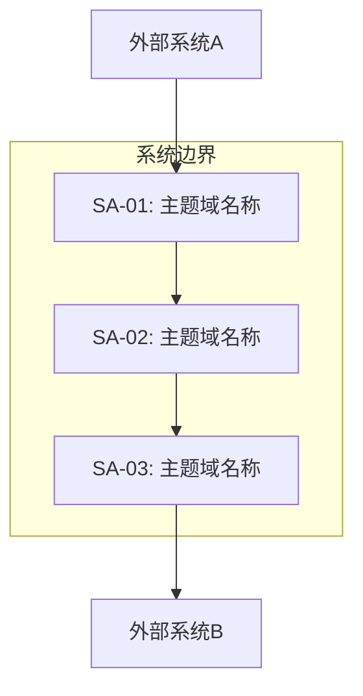

# 主题域划分模板

> SERU 阶段一交付物 — 将目标系统按业务职责划分为若干主题域，明确系统边界。

---

## 主题域划分 SA-[编号]

**项目名称**：[项目名称]
**分析日期**：[YYYY-MM-DD]
**分析人员**：[姓名]
**版本**：v[X.X]

---

### 1. 系统目标

> [用1-2句话描述系统的核心业务目标]

**业务愿景**：[系统建设的业务愿景]

**关键成功指标**：
- [ ] [指标1：量化描述]
- [ ] [指标2：量化描述]
- [ ] [指标3：量化描述]

---

### 2. 主要干系人

| 角色 | 代表人 | 关注点 | 影响力 | 参与度 |
|------|--------|--------|--------|--------|
| [角色名] | [姓名/部门] | [核心关注点] | 高/中/低 | 高/中/低 |
| [角色名] | [姓名/部门] | [核心关注点] | 高/中/低 | 高/中/低 |

---

### 3. 主题域列表

| 编号 | 主题域名称 | 业务职责描述 | 主要角色 | 核心业务事件 | 与其他主题域关系 |
|------|-----------|------------|---------|------------|----------------|
| SA-01 | [名称] | [用一句话描述该主题域的业务职责] | [参与角色列表] | [主要事件] | [依赖/调用关系] |
| SA-02 | [名称] | [职责描述] | [角色] | [事件] | [关系] |
| SA-03 | [名称] | [职责描述] | [角色] | [事件] | [关系] |

---

### 4. 系统边界图

> 使用 Mermaid 图描述主题域之间的关系和系统边界。

---

### 5. 外部接口

| 编号 | 外部系统 | 交互方式 | 交互数据 | 交互频率 | 关联主题域 |
|------|---------|---------|---------|---------|-----------|
| IF-01 | [系统名] | API/MQ/文件 | [数据描述] | 实时/批量 | SA-[XX] |
| IF-02 | [系统名] | [方式] | [数据] | [频率] | SA-[XX] |

---

### 6. 划分依据

**划分原则**：
1. **高内聚低耦合**：[说明如何确保各主题域内部职责紧密、域间松散耦合]
2. **业务职责单一**：[说明每个主题域只承担一类业务职责]
3. **边界清晰**：[说明域间接口和数据边界的定义方式]

**划分决策记录**：
- 决策1：[为什么这样划分？有什么备选方案？]
- 决策2：[某个功能归入哪个主题域？原因是什么？]

---

### 7. 填写指引

1. **系统目标**：从业务价值出发，不要写技术目标
2. **主题域**：按业务职责划分，不是按技术模块划分
3. **业务事件**：每个主题域至少识别3-5个核心业务事件
4. **外部接口**：包括人工接口和系统接口
5. **系统边界图**：使用 Mermaid graph 语法，只画节点和关系，不加样式
