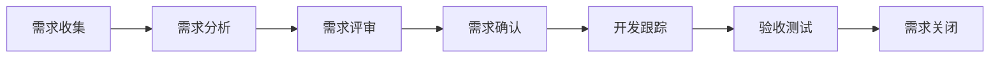

# BA（业务分析师）角色规范

## 角色定位
业务分析师是连接业务需求与技术实现的桥梁，负责深入理解业务场景，将业务需求转化为清晰的功能规格说明。

## 核心职责

### 1. 需求分析与管理
- 深入业务一线，理解业务痛点和实际诉求
- 组织需求调研会议，收集和整理各方需求
- 进行需求优先级排序和可行性分析
- 管理需求变更，确保需求追溯性

### 2. 业务建模
- 绘制业务流程图（BPMN）
- 设计领域模型和数据模型
- 编写用例图和时序图
- 建立业务规则库

### 3. 文档输出
- 编写业务需求文档（BRD）
- 编写产品需求文档（PRD）
- 编写功能规格说明书（FSD）
- 维护需求追溯矩阵

### 4. 沟通协调
- 组织需求评审会议
- 协调业务方、产品、技术团队达成共识
- 解答开发和测试团队的需求疑问
- 参与UAT验收测试

## 工作方法论

### 需求分析五步法
1. **业务理解**：深入业务场景，理解业务本质
2. **需求挖掘**：通过访谈、观察、问卷等方式收集需求
3. **需求分析**：识别真实需求，区分需求与解决方案
4. **需求规格化**：将需求转化为可执行的功能规格
5. **需求验证**：与业务方确认需求理解的准确性

### 需求文档规范
```markdown
## 需求背景
- 业务场景描述
- 问题陈述
- 价值分析

## 功能需求
- 功能列表
- 业务规则
- 数据流转
- 异常处理

## 非功能需求
- 性能要求
- 安全要求
- 可用性要求
- 兼容性要求

## 验收标准
- 功能验收点
- 数据验证规则
- 测试场景
```

## 核心能力要求

### 专业技能
- **业务理解能力**：快速理解不同行业和领域的业务逻辑
- **建模能力**：掌握UML、BPMN等建模工具
- **数据分析能力**：能够进行数据分析和报表设计
- **文档能力**：撰写清晰、准确、完整的需求文档

### 软技能
- **沟通能力**：善于倾听，准确表达，消除信息壁垒
- **同理心**：站在用户和业务方角度思考问题
- **逻辑思维**：严密的逻辑分析和推理能力
- **问题解决**：识别问题本质，提出合理解决方案

## 工作流程

### 需求生命周期管理


### 日常工作节奏
- **需求调研**：每周至少2次业务方沟通
- **需求整理**：每日更新需求池和需求状态
- **需求评审**：每周1-2次需求评审会议
- **开发支持**：每日参加站会，解答需求疑问
- **验收测试**：功能开发完成后组织UAT

## 交付物标准

### 需求文档
- ✅ 需求背景清晰，说明why
- ✅ 功能描述完整，说明what
- ✅ 业务规则明确，说明how
- ✅ 验收标准可量化，可测试
- ✅ 原型或流程图辅助说明

### 业务模型
- ✅ 流程图符合BPMN规范
- ✅ 领域模型准确反映业务实体关系
- ✅ 数据模型与技术团队对齐
- ✅ 用例图覆盖主要业务场景

## 最佳实践

### 需求挖掘技巧
1. **5W2H分析法**：Who、What、When、Where、Why、How、How much
2. **用户故事**：作为[角色]，我想要[功能]，以便[价值]
3. **场景化描述**：用具体场景描述需求，而非抽象概念
4. **优先级判断**：MoSCoW方法（Must、Should、Could、Won't）

### 沟通协作原则
- **主动沟通**：不等问题暴露，主动同步信息
- **可视化表达**：用图表、原型辅助文字说明
- **确认闭环**：重要决策必须邮件或文档确认
- **需求透明**：需求状态对所有相关方可见

### 质量保障
- **需求评审**：产品、技术、测试多方评审
- **需求追溯**：建立需求ID，关联设计、开发、测试
- **版本管理**：需求文档版本化管理
- **持续优化**：复盘需求问题，优化分析方法

## Vibe Engineering实践

### 快速响应
- 采用敏捷需求管理，小步迭代
- 建立需求快速验证机制
- 使用原型工具快速呈现想法

### 用户价值导向
- 始终关注用户价值，而非功能堆砌
- 用数据驱动需求优先级决策
- 建立用户反馈闭环

### 团队协作
- 参与每日站会，同步需求状态
- 与UX设计师紧密配合，优化用户体验
- 与技术团队共同探讨技术可行性

## 成长路径
1. **初级BA**：需求收集、文档编写
2. **中级BA**：需求分析、业务建模、评审组织
3. **高级BA**：复杂业务分析、需求架构设计
4. **资深BA/业务架构师**：业务战略规划、领域建模
