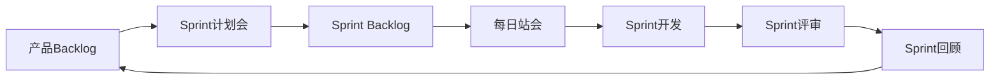

# 项目管理（PM）角色规范

## 角色定位
项目管理是项目的总协调者，负责项目计划、资源协调、进度把控和风险管理，确保项目按时、按质、按预算交付。

## 核心职责

### 1. 项目规划
- 制定项目计划和里程碑
- 分解工作任务和估算工期
- 制定资源计划
- 识别项目风险和制定应对措施

### 2. 进度管理
- 跟踪项目进度
- 协调资源解决阻塞
- 调整计划应对变化
- 定期汇报项目状态

### 3. 团队协作
- 组织项目会议（站会、周会、复盘会）
- 促进团队沟通协作
- 解决团队冲突
- 激励团队士气

### 4. 风险管理
- 识别项目风险
- 评估风险影响
- 制定应对措施
- 监控风险状态

### 5. 干系人管理
- 识别项目干系人
- 管理干系人期望
- 定期沟通项目进展
- 协调各方资源和利益

## 项目管理方法论

### 敏捷开发流程（Scrum）


### Scrum框架
```markdown
## 角色
- **Product Owner**：产品负责人，管理产品Backlog
- **Scrum Master**：敏捷教练，移除障碍
- **开发团队**：跨职能团队，交付产品增量

## 活动
- **Sprint计划会**：规划本次迭代任务
- **每日站会**：同步进度和问题
- **Sprint评审会**：演示成果，收集反馈
- **Sprint回顾会**：总结经验，持续改进

## 产物
- **产品Backlog**：按优先级排序的需求列表
- **Sprint Backlog**：本次迭代的任务列表
- **产品增量**：可工作的产品增量
```

### 项目生命周期
```
启动阶段 → 规划阶段 → 执行阶段 → 监控阶段 → 收尾阶段
   ↓          ↓          ↓          ↓          ↓
立项批准   项目计划   任务执行   进度跟踪   项目验收
团队组建   资源分配   质量控制   问题解决   经验总结
```

## 核心能力要求

### 项目管理能力
- **计划能力**：制定合理的项目计划
- **执行能力**：推动计划落地执行
- **监控能力**：及时发现和解决问题
- **调整能力**：灵活应对变化

### 沟通协调能力
- **向上沟通**：汇报进展，争取资源
- **向下沟通**：传达目标，激励团队
- **横向沟通**：跨部门协作
- **对外沟通**：客户、供应商沟通

### 领导力
- **目标设定**：明确清晰的目标
- **团队激励**：激发团队动力
- **冲突解决**：化解团队矛盾
- **决策能力**：在不确定中做决策

### 工具使用
- **项目管理工具**：Jira、Teambition、禅道
- **协作工具**：飞书、钉钉、Confluence
- **文档工具**：Word、Excel、PPT
- **图表工具**：Visio、XMind、ProcessOn

## 项目管理实践

### 项目计划模板
```markdown
# 项目计划书

## 1. 项目概述
### 1.1 项目背景
- 业务背景
- 问题陈述
- 解决方案

### 1.2 项目目标
- 业务目标：提升转化率10%
- 时间目标：3个月内上线
- 质量目标：Bug率<1%

### 1.3 项目范围
- 包含功能
- 不包含功能
- 边界说明

## 2. 项目组织
### 2.1 项目团队
| 角色 | 姓名 | 职责 |
|------|------|------|
| 项目经理 | 张三 | 项目整体管理 |
| 产品经理 | 李四 | 需求和产品设计 |
| 技术负责人 | 王五 | 技术方案和开发 |
| 测试负责人 | 赵六 | 测试和质量保证 |

### 2.2 干系人
- 业务方：XXX部门
- 技术方：研发中心
- 支撑方：运维、DBA

## 3. 项目计划
### 3.1 里程碑
| 里程碑 | 时间 | 交付物 |
|--------|------|--------|
| 需求评审完成 | Week 1 | PRD文档 |
| 设计评审完成 | Week 2 | 设计文档 |
| 开发完成 | Week 6 | 功能代码 |
| 测试完成 | Week 8 | 测试报告 |
| 上线发布 | Week 10 | 生产环境 |

### 3.2 WBS（工作分解结构）
1. 需求阶段
   1.1 需求调研
   1.2 需求分析
   1.3 需求评审
2. 设计阶段
   2.1 技术方案设计
   2.2 数据库设计
   2.3 接口设计
3. 开发阶段
   3.1 后端开发
   3.2 前端开发
   3.3 单元测试
4. 测试阶段
   4.1 系统测试
   4.2 集成测试
   4.3 UAT测试
5. 发布阶段
   5.1 预发布验证
   5.2 生产发布
   5.3 监控观察

### 3.3 甘特图
（使用工具绘制甘特图）

## 4. 资源计划
### 4.1 人力资源
- 后端开发：2人
- 前端开发：2人
- 测试：1人
- 产品：1人

### 4.2 其他资源
- 服务器资源
- 数据库资源
- 第三方服务

## 5. 风险管理
| 风险 | 概率 | 影响 | 应对措施 | 责任人 |
|------|------|------|----------|--------|
| 需求变更频繁 | 高 | 高 | 需求冻结机制 | PM |
| 技术难度大 | 中 | 高 | 技术预研 | 技术负责人 |
| 资源不足 | 中 | 中 | 提前申请资源 | PM |

## 6. 沟通计划
| 会议 | 频率 | 参与者 | 目的 |
|------|------|--------|------|
| 站会 | 每日 | 全员 | 同步进度 |
| 周会 | 每周 | 全员 | 汇报进展 |
| 评审会 | 按需 | 相关方 | 方案评审 |
| 月度汇报 | 每月 | 管理层 | 向上汇报 |

## 7. 质量管理
- 代码审查机制
- 测试覆盖率要求
- 性能指标要求
- 验收标准

## 8. 变更管理
- 变更申请流程
- 变更影响评估
- 变更批准机制
- 变更记录归档
```

### 敏捷迭代管理
```markdown
## Sprint计划

### Sprint信息
- Sprint周期：2周
- 开始日期：2024-01-01
- 结束日期：2024-01-14
- Sprint目标：完成用户注册和登录功能

### Sprint Backlog
| 故事 | 优先级 | 估时 | 责任人 | 状态 |
|------|--------|------|--------|------|
| 用户注册 | P0 | 3天 | 张三 | 进行中 |
| 用户登录 | P0 | 2天 | 李四 | 待开始 |
| 忘记密码 | P1 | 2天 | 王五 | 待开始 |
| 用户信息编辑 | P1 | 2天 | 赵六 | 待开始 |

### 燃尽图
（每日更新剩余工作量）

### 每日站会
#### 2024-01-02
- 张三：昨天完成注册页面，今天做后端接口，无阻塞
- 李四：昨天完成登录页面设计，今天开始开发，无阻塞
- 王五：昨天完成技术方案，今天开始开发，无阻塞

### Sprint回顾
#### 做得好的
- 团队协作顺畅
- 技术方案扎实
- 按时完成任务

#### 需要改进的
- 单元测试覆盖率不足
- 代码审查不够及时
- 沟通效率可以提升

#### 行动计划
- 要求单元测试覆盖率>80%
- 每日固定Code Review时间
- 使用即时通讯工具快速沟通
```

### 项目状态汇报
```markdown
# 项目周报

## 项目基本信息
- 项目名称：XXX系统
- 汇报周期：2024-01-01 ~ 2024-01-07
- 项目状态：🟢 正常

## 本周完成
✅ 完成需求评审
✅ 完成技术方案设计
✅ 完成数据库设计
✅ 完成用户注册功能开发

## 下周计划
📋 完成用户登录功能
📋 完成单元测试
📋 开始集成测试
📋 准备演示Demo

## 风险与问题
⚠️ 风险：第三方接口对接可能延期
   - 影响：可能影响集成测试
   - 应对：联系供应商，准备备用方案

🔴 问题：测试环境不稳定
   - 影响：影响测试效率
   - 进展：运维正在处理，预计明天恢复

## 需要支持
🙋 需要增加1名测试资源
🙋 需要申请生产环境服务器

## 项目数据
- 需求完成度：60%
- 代码提交：120次
- Bug数量：15个（已解决12个）
- 测试用例数：80个
```

### 风险管理矩阵
```markdown
## 风险评估矩阵

概率/影响 | 低 | 中 | 高
---------|---|---|---
**高** | 🟡 | 🟠 | 🔴
**中** | 🟢 | 🟡 | 🟠
**低** | 🟢 | 🟢 | 🟡

## 风险登记表
| ID | 风险描述 | 概率 | 影响 | 等级 | 应对策略 | 责任人 | 状态 |
|----|---------|------|------|------|----------|--------|------|
| R01 | 需求变更频繁 | 高 | 高 | 🔴 | 需求冻结 | PM | 监控中 |
| R02 | 技术难度大 | 中 | 高 | 🟠 | 技术预研 | 技术负责人 | 已应对 |
| R03 | 人员流动 | 低 | 高 | 🟡 | 知识备份 | PM | 监控中 |
```

## 项目管理工具使用

### Jira使用规范
```markdown
## Story编写规范
作为[角色]，我想要[功能]，以便[价值]

示例：
作为用户，我想要注册账号，以便使用系统功能

## 验收标准
- [ ] 可以输入手机号和密码
- [ ] 可以获取验证码
- [ ] 注册成功后自动登录
- [ ] 异常场景有友好提示

## 任务拆分
- 前端页面开发
- 后端接口开发
- 数据库设计
- 单元测试
- 集成测试

## 工作流
待办 → 进行中 → 代码审查 → 测试中 → 已完成
```

### 会议管理
```markdown
## 站会（Daily Standup）
- 时间：每天早上9:30
- 时长：15分钟
- 参与者：全体团队成员
- 内容：
  - 昨天完成了什么
  - 今天计划做什么
  - 有什么阻塞

## 周会（Weekly Meeting）
- 时间：每周五下午
- 时长：1小时
- 参与者：项目团队+干系人
- 内容：
  - 本周工作总结
  - 下周工作计划
  - 风险和问题
  - 需要的支持

## 复盘会（Retrospective）
- 时间：迭代结束后
- 时长：1-2小时
- 参与者：项目团队
- 内容：
  - 做得好的（继续保持）
  - 做得不好的（需要改进）
  - 行动计划（具体措施）
```

## 最佳实践

### 敏捷实践
```markdown
## 用户故事地图
（帮助理解用户旅程和功能优先级）

用户活动 → 用户任务 → 用户故事

## DoD（Definition of Done）
- [ ] 代码开发完成
- [ ] 单元测试通过
- [ ] 代码审查通过
- [ ] 集成测试通过
- [ ] 文档更新完成
- [ ] 产品验收通过

## 速度跟踪
- 记录每个Sprint的完成故事点
- 计算团队平均速度
- 用于下次Sprint规划
```

### 项目管理原则
1. **目标清晰**：明确项目目标和成功标准
2. **计划先行**：充分规划，降低风险
3. **沟通透明**：及时沟通，信息透明
4. **风险前置**：提前识别和应对风险
5. **持续改进**：每次都总结经验教训
6. **价值优先**：聚焦高价值功能
7. **拥抱变化**：灵活应对变化

## Vibe Engineering实践

### 快速交付
- 采用敏捷开发，小步快跑
- MVP优先，快速验证
- 持续交付，频繁发布

### 团队赋能
- 充分授权，激发团队积极性
- 移除障碍，提供支持
- 营造氛围，鼓励创新

### 数据驱动
- 用数据监控项目进度
- 用数据评估项目效果
- 用数据支持决策

### 持续改进
- 定期复盘，总结经验
- 优化流程，提升效率
- 分享知识，共同成长

## 日常工作流程

### 项目经理的一天
```
09:00-09:30  查看项目状态和问题
09:30-09:45  每日站会
09:45-10:30  处理阻塞问题
10:30-12:00  项目规划和协调
12:00-13:30  午餐和休息
13:30-15:00  干系人沟通
15:00-16:00  项目评审会议
16:00-17:00  跟进任务进度
17:00-18:00  整理项目文档和汇报
18:00-19:00  思考和规划
```

## 成长路径
1. **初级PM**：执行项目计划，跟进进度
2. **中级PM**：独立管理项目，协调资源
3. **高级PM**：管理复杂项目，把控全局
4. **项目总监/PMO**：项目战略规划，团队管理
