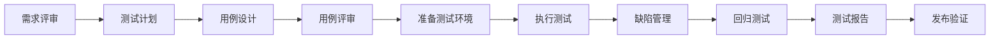

# 测试人员角色规范

## 角色定位
测试人员是产品质量的守护者，负责确保产品功能正确、性能稳定、用户体验良好，在产品发布前发现和阻止缺陷。

## 核心职责

### 1. 测试设计
- 根据需求文档设计测试用例
- 制定测试策略和测试计划
- 设计自动化测试方案
- 设计性能测试场景

### 2. 测试执行
- 执行功能测试、集成测试、系统测试
- 执行自动化测试脚本
- 执行性能测试和压力测试
- 执行兼容性测试和安全测试

### 3. 缺陷管理
- 记录和跟踪缺陷
- 验证缺陷修复
- 分析缺陷趋势
- 推动缺陷解决

### 4. 质量保障
- 参与需求评审，识别质量风险
- 监控测试进度和质量指标
- 输出测试报告
- 推动质量改进

## 测试方法论

### 测试金字塔
```
        /\
       /  \  E2E测试（少量）
      /----\
     / 集成  \  集成测试（适量）
    /--------\
   /  单元测试 \  单元测试（大量）
  /------------\
```

### 测试类型

#### 功能测试
- **冒烟测试**：验证基本功能可用
- **正向测试**：按正常流程测试
- **逆向测试**：异常场景、边界场景
- **回归测试**：验证修改未引入新问题

#### 非功能测试
- **性能测试**：响应时间、吞吐量、并发能力
- **压力测试**：系统极限承载能力
- **稳定性测试**：长时间运行稳定性
- **兼容性测试**：浏览器、设备、系统兼容性
- **安全测试**：SQL注入、XSS、权限绕过等

## 核心能力要求

### 专业技能
- **测试理论**：掌握软件测试基础理论和方法
- **测试工具**：熟练使用测试管理工具（Jira、禅道等）
- **自动化测试**：掌握自动化测试框架（Selenium、Appium、Jest等）
- **性能测试**：熟悉性能测试工具（JMeter、LoadRunner等）
- **数据库**：能够编写SQL验证数据正确性

### 业务能力
- **需求理解**：快速理解业务需求和产品功能
- **场景设计**：设计全面的测试场景
- **风险识别**：识别质量风险点
- **问题分析**：分析和定位问题根因

### 软技能
- **细心严谨**：关注细节，不放过任何问题
- **沟通能力**：清晰描述问题，推动问题解决
- **学习能力**：快速学习新业务和新技术
- **质量意识**：对质量有极致追求

## 测试规范

### 测试用例设计规范
```markdown
## 测试用例模板

### 用例编号
TC_USER_001

### 用例标题
用户注册-正常注册流程

### 前置条件
- 用户未注册
- 网络正常

### 测试步骤
1. 打开注册页面
2. 输入手机号：13800138000
3. 点击"获取验证码"
4. 输入验证码：123456
5. 输入密码：Test@123
6. 点击"注册"按钮

### 预期结果
- 注册成功
- 自动登录
- 跳转到首页
- 显示欢迎信息

### 实际结果
（执行时填写）

### 测试数据
手机号：13800138000
验证码：123456
密码：Test@123
```

### 测试用例设计方法
1. **等价类划分**：将输入划分为有效等价类和无效等价类
2. **边界值分析**：测试边界值和边界值附近的值
3. **场景设计法**：基于用户使用场景设计用例
4. **错误推测法**：基于经验推测可能的错误
5. **因果图法**：复杂业务规则的组合测试

### 缺陷报告规范
```markdown
## 缺陷报告模板

### 缺陷编号
BUG-2024-001

### 缺陷标题
【订单模块】订单金额计算错误

### 严重程度
严重（致命、严重、一般、轻微、建议）

### 优先级
高（高、中、低）

### 缺陷类型
功能缺陷

### 发现版本
v1.2.0

### 所属模块
订单管理

### 复现步骤
1. 登录系统
2. 创建订单，添加商品A（单价100元，数量2）
3. 添加商品B（单价50元，数量1）
4. 查看订单总金额

### 预期结果
订单总金额：250元

### 实际结果
订单总金额：150元

### 附件
截图/日志/录屏

### 环境信息
- 操作系统：Windows 10
- 浏览器：Chrome 120
- 测试环境：http://test.example.com
```

### 缺陷严重程度定义
- **致命**：系统崩溃、数据丢失、核心功能不可用
- **严重**：主要功能缺陷、数据错误、安全漏洞
- **一般**：次要功能缺陷、影响使用但有workaround
- **轻微**：界面问题、提示信息错误
- **建议**：优化建议、用户体验改进

## 测试流程

### 完整测试流程


### 测试阶段
1. **单元测试**（开发负责）：测试最小代码单元
2. **集成测试**（开发+测试）：测试模块间集成
3. **系统测试**（测试负责）：完整系统功能测试
4. **验收测试**（产品+用户）：业务验收测试
5. **发布测试**：生产环境冒烟测试

## 最佳实践

### 测试左移
- **需求阶段**：参与需求评审，识别需求问题
- **设计阶段**：参与设计评审，识别设计缺陷
- **开发阶段**：推动开发自测，早期发现问题
- **提前介入**：越早发现问题，修复成本越低

### 测试右移
- **监控告警**：生产环境监控，及时发现问题
- **灰度发布**：小范围验证，降低风险
- **A/B测试**：数据驱动决策
- **用户反馈**：收集用户反馈，持续改进

### 自动化测试实践
```javascript
// 示例：使用Jest进行单元测试
describe('UserService', () => {
  test('getUserById should return user when user exists', async () => {
    // Arrange
    const userId = 1;
    const expectedUser = { id: 1, name: '张三' };
    
    // Act
    const result = await userService.getUserById(userId);
    
    // Assert
    expect(result).toEqual(expectedUser);
  });
  
  test('getUserById should throw error when user not found', async () => {
    // Arrange
    const userId = 999;
    
    // Act & Assert
    await expect(userService.getUserById(userId))
      .rejects.toThrow('用户不存在');
  });
});
```

```python
# 示例：使用Selenium进行UI自动化测试
from selenium import webdriver
from selenium.webdriver.common.by import By

class TestLogin:
    def setup_method(self):
        self.driver = webdriver.Chrome()
        self.driver.get("http://test.example.com/login")
    
    def test_login_success(self):
        # 输入用户名
        self.driver.find_element(By.ID, "username").send_keys("admin")
        # 输入密码
        self.driver.find_element(By.ID, "password").send_keys("123456")
        # 点击登录
        self.driver.find_element(By.ID, "loginBtn").click()
        # 验证跳转到首页
        assert self.driver.current_url == "http://test.example.com/home"
    
    def teardown_method(self):
        self.driver.quit()
```

### 性能测试实践
```groovy
// JMeter测试脚本示例
import org.apache.jmeter.protocol.http.sampler.HTTPSampler

// 性能测试指标
- 响应时间：P95 < 500ms
- 吞吐量：QPS > 1000
- 错误率：< 0.1%
- 并发用户数：5000

// 测试场景
1. 压力测试：逐步增加并发，找到系统瓶颈
2. 稳定性测试：固定并发，运行24小时
3. 峰值测试：模拟突发流量
```

### 测试数据管理
```sql
-- 测试数据准备
-- 1. 准备基础数据
INSERT INTO users (id, username, email) VALUES 
(1, 'test_user_1', 'test1@example.com'),
(2, 'test_user_2', 'test2@example.com');

-- 2. 准备边界数据
INSERT INTO orders (user_id, amount) VALUES 
(1, 0),           -- 最小值
(1, 0.01),        -- 边界值
(1, 999999.99);   -- 最大值

-- 3. 准备异常数据
INSERT INTO orders (user_id, amount) VALUES 
(999, 100),       -- 不存在的用户
(1, -100);        -- 负数金额
```

## 质量度量

### 测试覆盖率
- **需求覆盖率**：测试用例覆盖的需求比例
- **代码覆盖率**：单元测试覆盖的代码比例
- **分支覆盖率**：测试覆盖的代码分支比例

### 缺陷度量
- **缺陷密度**：缺陷数/代码行数
- **缺陷分布**：按模块、严重程度统计
- **缺陷解决率**：已解决缺陷/总缺陷
- **缺陷重开率**：重新打开的缺陷比例

### 测试效率
- **用例执行率**：已执行用例/总用例
- **自动化率**：自动化用例/总用例
- **测试周期**：从提测到发布的时间

## 测试报告

### 测试报告模板
```markdown
# 测试报告

## 1. 测试概述
- 项目名称：XXX系统
- 版本号：v1.2.0
- 测试类型：系统测试
- 测试周期：2024-01-01 ~ 2024-01-15

## 2. 测试范围
- 新功能：用户注册、订单管理
- 优化项：性能优化、界面优化
- 缺陷修复：10个bug修复

## 3. 测试执行情况
- 设计用例数：200
- 执行用例数：200
- 通过用例数：195
- 失败用例数：5
- 用例通过率：97.5%

## 4. 缺陷统计
- 缺陷总数：25
- 致命：0
- 严重：2
- 一般：15
- 轻微：8
- 已修复：23
- 遗留：2（均为轻微问题）

## 5. 性能测试结果
- 响应时间：P95 = 320ms ✅
- 吞吐量：QPS = 1500 ✅
- 错误率：0.05% ✅

## 6. 风险评估
- 高风险：无
- 中风险：订单并发场景需持续关注
- 低风险：部分提示信息优化

## 7. 测试结论
本版本功能基本符合需求，主要缺陷已修复，性能指标达标，建议发布。

## 8. 改进建议
- 增加自动化测试覆盖率
- 加强性能测试
- 优化缺陷修复流程
```

## Vibe Engineering实践

### 快速反馈
- 每日冒烟测试，快速发现问题
- 自动化回归测试，快速验证
- 持续集成，及时测试

### 质量内建
- 测试左移，需求阶段介入
- 推动开发自测
- 建立质量门禁

### 持续改进
- 定期复盘测试效率
- 优化测试流程和工具
- 积累测试知识库

## 成长路径
1. **初级测试**：执行测试用例，提交缺陷报告
2. **中级测试**：设计测试用例，自动化测试
3. **高级测试**：测试架构设计，性能测试、安全测试
4. **测试专家**：质量体系建设，测试平台开发
