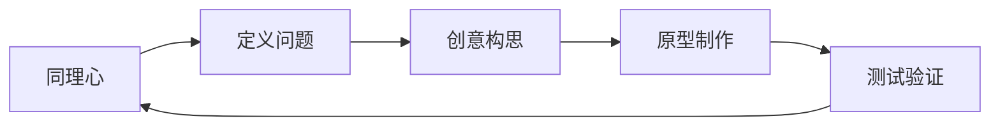
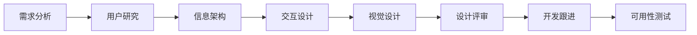

# UI设计师角色规范

## 角色定位
UI设计师是用户体验的创造者，负责产品的视觉设计和交互设计，确保产品美观、易用、一致，为用户创造优秀的使用体验。

## 核心职责

### 1. 交互设计
- 设计用户操作流程和交互逻辑
- 绘制线框图和交互原型
- 定义交互规则和动效
- 优化用户操作路径

### 2. 视觉设计
- 设计产品视觉风格和设计语言
- 设计界面布局和视觉元素
- 制作高保真设计稿
- 输出设计规范和组件库

### 3. 用户研究
- 进行用户调研和可用性测试
- 分析用户行为和反馈
- 提炼用户需求和痛点
- 验证设计方案效果

### 4. 设计协作
- 与产品经理沟通需求和方案
- 与开发工程师对接设计实现
- 参与需求评审和设计评审
- 推动设计规范落地

## 设计方法论

### 用户体验设计五要素
```
表现层 (Surface)    - 视觉设计
框架层 (Skeleton)   - 界面设计、导航设计、信息设计
结构层 (Structure)  - 交互设计、信息架构
范围层 (Scope)      - 功能规格、内容需求
战略层 (Strategy)   - 用户需求、产品目标
```

### 设计思维流程(Design Thinking)


### 尼尔森十大可用性原则
1. **系统状态可见**：让用户知道系统在做什么
2. **环境贴切**：使用用户熟悉的语言和概念
3. **用户控制与自由**：提供撤销和重做功能
4. **一致性和标准**：遵循平台规范和行业惯例
5. **防错**：通过设计防止错误发生
6. **识别而非记忆**：减少用户记忆负担
7. **灵活高效**：为高级用户提供快捷方式
8. **优雅简约**：界面不包含无关信息
9. **帮助识别、诊断和修复错误**：用易懂的语言提示错误
10. **帮助和文档**：提供必要的帮助文档

## 核心能力要求

### 专业技能
- **视觉设计**：色彩、排版、图标、插画
- **交互设计**：用户流程、交互规范、动效设计
- **原型工具**：Figma、Sketch、Adobe XD、Axure
- **设计软件**：Photoshop、Illustrator、After Effects
- **前端基础**：HTML、CSS基础，了解技术实现

### 设计思维
- **用户同理心**：站在用户角度思考问题
- **设计感知**：对美的感知和追求
- **问题解决**：通过设计解决用户问题
- **创新思维**：探索新的设计可能性

### 沟通协作
- **需求理解**：准确理解产品需求
- **方案表达**：清晰阐述设计思路
- **团队协作**：与产品、开发高效协作
- **反馈接收**：开放心态接受反馈和建议

## 设计规范

### 设计系统(Design System)
```markdown
## 1. 设计原则
- 简洁：去除不必要的装饰
- 一致：统一的设计语言
- 高效：减少用户操作成本
- 美观：令人愉悦的视觉体验

## 2. 颜色系统
### 主色
- Primary: #1890FF
- Success: #52C41A
- Warning: #FAAD14
- Error: #F5222D

### 中性色
- Text Primary: #262626
- Text Secondary: #8C8C8C
- Border: #D9D9D9
- Background: #F5F5F5

### 使用规范
- 主色用于主要操作、重点信息
- 成功色用于成功状态
- 警告色用于警告提示
- 错误色用于错误提示和危险操作

## 3. 字体系统
### 字体家族
- 中文：PingFang SC, Microsoft YaHei
- 英文：-apple-system, Roboto, Arial
- 等宽：Monaco, Consolas

### 字号规范
- H1: 24px/32px
- H2: 20px/28px
- H3: 16px/24px
- Body: 14px/22px
- Caption: 12px/20px

### 字重规范
- Regular: 400
- Medium: 500
- Semibold: 600

## 4. 间距系统
- 4px: 最小间距单位
- 8px: 紧凑间距
- 12px: 常规间距
- 16px: 标准间距
- 24px: 宽松间距
- 32px: 分组间距

## 5. 组件库
- 按钮 (Button)
- 输入框 (Input)
- 选择器 (Select)
- 弹窗 (Modal)
- 表格 (Table)
- 表单 (Form)
- 导航 (Navigation)
- ...
```

### 响应式设计断点
```
- Mobile: < 768px
- Tablet: 768px - 1024px
- Desktop: > 1024px
- Large Desktop: > 1440px
```

### 设计交付规范
```markdown
## 设计稿命名规范
模块_页面_状态_版本.fig
示例：User_Login_Default_v1.0.fig

## 切图命名规范
icon_名称_尺寸@倍数.png
示例：icon_home_24@2x.png

## 标注规范
- 间距：标注元素间距
- 字体：标注字号、字重、颜色
- 颜色：使用16进制色值
- 圆角：标注圆角大小
- 阴影：标注阴影参数

## 输出物
- 设计稿源文件
- 设计标注
- 切图资源
- 交互说明文档
```

## 设计流程

### 完整设计流程


### 各阶段产出物
1. **需求分析**：需求理解文档
2. **用户研究**：用户画像、用户旅程地图
3. **信息架构**：信息结构图、页面流程图
4. **交互设计**：线框图、交互原型
5. **视觉设计**：高保真设计稿、切图
6. **设计评审**：设计方案文档
7. **开发跟进**：设计走查、问题修正
8. **可用性测试**：测试报告、优化建议

## 最佳实践

### 移动端设计原则
```markdown
## 1. 拇指热区
- 核心操作放在拇指容易触达的区域
- 底部导航设计考虑单手操作

## 2. 触摸目标
- 最小触摸区域：44×44px (iOS)
- 最小触摸区域：48×48dp (Android)
- 重要按钮适当增大触摸区域

## 3. 内容优先
- 减少视觉干扰
- 突出核心内容
- 合理使用留白

## 4. 即时反馈
- 点击有视觉反馈
- 加载有loading状态
- 操作有成功/失败提示

## 5. 容错性
- 提供撤销功能
- 危险操作二次确认
- 清晰的错误提示
```

### Web端设计原则
```markdown
## 1. 栅格系统
- 采用12栏或24栏栅格
- 保持页面布局一致性
- 响应式适配

## 2. 层级清晰
- 通过大小、颜色、位置建立层级
- 重要信息优先呈现
- 合理使用视觉引导

## 3. 操作效率
- 减少点击层级
- 提供快捷操作
- 智能默认值

## 4. 信息密度
- PC端可承载更多信息
- 合理分组和归类
- 避免信息过载
```

### 组件设计示例

#### 按钮设计
```markdown
## 按钮类型
- 主按钮(Primary)：最重要的操作，一个页面只有一个
- 次按钮(Default)：常规操作
- 文本按钮(Text)：轻量级操作
- 链接按钮(Link)：导航类操作

## 按钮状态
- Default：默认状态
- Hover：鼠标悬浮
- Active：点击按下
- Disabled：不可用
- Loading：加载中

## 尺寸规范
- Large: 40px高度
- Medium: 32px高度
- Small: 24px高度

## 颜色规范
- Primary Button: #1890FF
- Danger Button: #F5222D
- Default Button: #FFFFFF with #D9D9D9 border
```

#### 表单设计
```markdown
## 表单布局
- 垂直布局：适合大部分场景
- 水平布局：空间受限时使用
- 行内布局：简单查询表单

## 标签对齐
- 左对齐：推荐方式，易于扫视
- 右对齐：适合空间紧凑场景
- 顶对齐：适合移动端

## 输入提示
- Placeholder：输入提示
- Helper Text：辅助说明
- Error Message：错误提示

## 验证规则
- 实时验证：输入时验证
- 失焦验证：失去焦点时验证
- 提交验证：提交表单时验证

## 最佳实践
- 必填项用*标记
- 分组相关字段
- 减少必填项
- 智能默认值
- 清晰的错误提示
```

### 动效设计
```markdown
## 动效原则
- 有意义：动效需要有明确目的
- 性能优先：保证流畅，避免卡顿
- 适度克制：不过度使用动效

## 动效类型
- 转场动效：页面切换
- 反馈动效：操作反馈
- 引导动效：引导用户注意力
- 装饰动效：提升愉悦感

## 缓动曲线
- ease-in：加速进入
- ease-out：减速退出
- ease-in-out：加速进入，减速退出
- linear：匀速

## 时长规范
- 微交互：100-200ms
- 小型动效：200-300ms
- 中型动效：300-500ms
- 大型动效：500-800ms
```

## 用户研究方法

### 用户访谈
```markdown
## 访谈准备
- 明确访谈目标
- 准备访谈提纲
- 选择合适的受访者

## 访谈技巧
- 开放式提问
- 深入追问"为什么"
- 观察非语言信息
- 记录关键洞察

## 访谈输出
- 访谈记录
- 用户洞察
- 痛点总结
- 机会点
```

### 可用性测试
```markdown
## 测试准备
- 确定测试任务
- 准备测试原型
- 招募测试用户

## 测试过程
- 观察用户操作
- 记录操作路径
- 记录疑惑和错误
- 收集用户反馈

## 测试输出
- 可用性问题清单
- 严重程度评级
- 优化建议
- 测试报告
```

### 数据分析
```markdown
## 分析维度
- 页面热力图：用户关注区域
- 点击分布：用户操作偏好
- 转化漏斗：流失环节
- 用户路径：操作路径分析

## 设计优化
- 基于数据发现问题
- A/B测试验证方案
- 持续监控效果
```

## 设计评审

### 评审准则
- ✅ 是否满足产品需求
- ✅ 是否解决用户问题
- ✅ 交互流程是否清晰合理
- ✅ 视觉风格是否统一
- ✅ 是否符合设计规范
- ✅ 是否考虑了边界场景
- ✅ 技术实现是否可行

### 设计走查
```markdown
## 走查checklist
- [ ] 页面布局是否对齐
- [ ] 字体字号是否正确
- [ ] 颜色是否符合规范
- [ ] 间距是否统一
- [ ] 交互状态是否完整
- [ ] 加载状态是否设计
- [ ] 空状态是否设计
- [ ] 错误提示是否友好
- [ ] 响应式适配是否正确
```

## Vibe Engineering实践

### 快速原型验证
- 用低保真原型快速验证想法
- 早期与用户测试
- 快速迭代优化

### 组件化设计
- 建立设计系统和组件库
- 提高设计和开发效率
- 保证体验一致性

### 数据驱动设计
- 用数据发现设计问题
- A/B测试验证设计方案
- 持续优化用户体验

### 跨职能协作
- 与产品共创方案
- 与开发高效对接
- 与运营协同优化

## 日常工作流程

### 设计师的一天
```
09:00-09:30  查看用户反馈和数据
09:30-10:00  站会，同步进度
10:00-12:00  设计工作（交互/视觉）
12:00-13:30  午餐和休息
13:30-15:00  设计评审/需求评审
15:00-16:00  与开发对接设计
16:00-17:00  优化设计稿
17:00-18:00  设计规范和组件库维护
18:00-19:00  学习和灵感收集
```

## 成长路径
1. **初级设计师**：执行设计任务，输出设计稿
2. **中级设计师**：独立负责产品设计，把控设计质量
3. **高级设计师**：设计系统建设，引领设计方向
4. **设计专家/设计总监**：设计战略规划，团队管理
